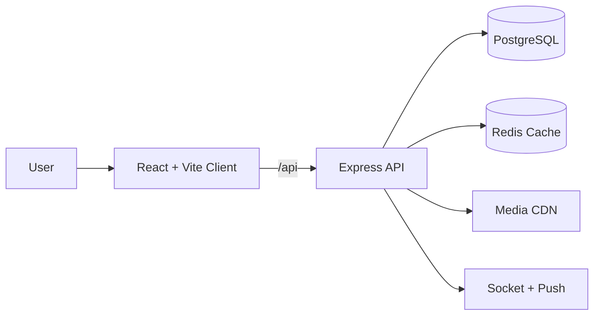

<p align="center">
  
  
  
  
  
  
  
  
  
  
  
  
</p>

<h1 align="center">MHub</h1>
<p align="center"><strong>Trust‑first marketplace and community platform with verified commerce, rewards, and real‑time engagement.</strong></p>
<p align="center">MHub unifies listings, chat, rewards, and operational rigor into a single production‑ready platform built for mobile‑first commerce and resilient scale.</p>

<p align="center">
  <a href="#-executive-summary">Executive Summary</a> •
  <a href="#-quick-start">Quick Start</a> •
  <a href="#-architecture-overview">Architecture</a> •
  <a href="#-feature--module-catalog">Features</a> •
  <a href="#-security-model">Security</a> •
  <a href="#-deployment--cicd">Deployment</a>
</p>

<details>
<summary><strong>Table of Contents</strong></summary>

- 🚀 Executive Summary
- ⚡ Quick Start
- 🏗️ Architecture Overview
- 🧰 Technology Stack
- 🗂️ Project Structure
- 🧩 Feature / Module Catalog
- 🔐 Authentication & Authorization
- 🧭 Roles & Permissions
- 🗄️ Database Schema / Data Model
- 🏢 Multi‑Tenancy & Scalability
- 🎨 Design System / UI Components
- 🧭 Routing Architecture
- 🔄 State Management & Data Flow
- 🔌 API Layer / Integrations
- ⏱️ Real‑time Features & Background Jobs
- 📴 Offline Strategy & Resilience
- ⚡ Performance Optimization
- 🛡️ Security Model
- 🧪 Testing Strategy
- 🚀 Deployment & CI/CD
- 🧩 Environment Configuration
- 📈 Monitoring & Observability
- 🤝 Contributing Guidelines
- 🛣️ Roadmap
- 📄 License
- 🙏 Acknowledgments
- 📚 Appendices

</details>

## 🚀 Executive Summary

MHub solves the core marketplace problem of **trust at scale** by combining verified transactions, transparent rewards, and operational guardrails. It targets buyers, sellers, and administrators who need a real‑time commerce platform that remains reliable on mobile devices and predictable under growth.

**Primary users**
- Buyers who need verified, high‑signal listings and safe transactions.
- Sellers who need easy listing workflows, reputation signals, and growth incentives.
- Operations and admins who need governance, auditability, and policy enforcement.

**Key differentiators**

| Differentiator | Description |
|---|---|
| Verified sale rewards | Rewards are granted only after OTP‑verified transactions, aligning incentives with trust. |
| Localization‑first UX | 26 locales with i18n pipelines and translation contracts for consistent multi‑language delivery. |
| Operational guardrails | Runtime budgets, readiness checks, WAF controls, and automated release gates. |
| Real‑time engagement | Chat, notifications, and rewards updates built on socket infrastructure. |
| Mobile‑first delivery | PWA + responsive UI with explicit touch‑target and layout standards. |
| Ledger‑backed rewards | Auditable reward log and referral hierarchy with chain computations. |
| Scalable data layer | PostgreSQL with structured migrations + optional Redis caching. |

## ⚡ Quick Start

### Prerequisites

| Tool | Version | Purpose |
|---|---|---|
| Node.js | 18+ LTS | Client + server runtime |
| npm | 9+ | Workspace package manager |
| PostgreSQL | 13+ | Primary database |
| Redis | Optional | Cache + session storage |

### Installation & Local Development

```bash
1) Clone the repository
   git clone https://github.com/mhub/mhub.git

2) Install workspace dependencies
   cd Mhub
   npm run install:all

3) Configure environment files
   copy client/.env.example client/.env
   copy server/.env.example server/.env

4) Run the full stack
   npm run dev

5) Build the client for production
   npm --prefix client run build

6) Run tests
   npm --prefix client run test
   npm --prefix server run test
```

**Default local endpoints**
- Client: `http://localhost:8081`
- API: `http://localhost:5001`

### Available Scripts (Common)

| Command | Description |
|---|---|
| `npm run dev` | Start the workspace dev orchestrator (client + server). |
| `npm run install:all` | Install dependencies for both client and server. |
| `npm run doctor` | Run repository health checks and diagnostics. |
| `npm run ops:gate:strict:enforced` | Enforce release readiness + failover + backup gates. |
| `npm --prefix client run build` | Build the client bundle with Vite. |
| `npm --prefix server run start` | Start the API server in production mode. |

## 🏗️ Architecture Overview

### High‑level topology (ASCII)

```text
+-------------------------+        +----------------------+        +------------------+
|  Web / PWA / Mobile App | <----> |  Express API Layer   | <----> |  PostgreSQL DB    |
|  React + Vite + i18n    |        |  Auth + Policies     |        |  Rewards Ledger  |
+-----------+-------------+        +----------+-----------+        +---------+--------+
            |                                    |                            |
            |                                    |                            |
            v                                    v                            v
+-------------------------+        +----------------------+        +------------------+
|  Realtime (Socket.io /  |        |  Cache + Sessions    |        |  Media Storage   |
|  Pusher + Web Push)     |        |  Redis (optional)    |        |  Cloudinary      |
+-------------------------+        +----------------------+        +------------------+
```

### System architecture (Mermaid)



### Design principles → implementation mapping

| Principle | Why it exists | How it is implemented |
|---|---|---|
| Trust‑first commerce | Reduce fraud + dispute risk | OTP‑verified sale flow, reward ledger, review moderation |
| Mobile‑first UX | Majority of traffic is mobile | Responsive layouts, PWA shell, touch‑target rules |
| Contract‑driven APIs | Prevent regressions | API contract guard + schema preflight + route probes |
| Operational rigor | Predictable releases | Ops gates, readiness checks, backups, release scripts |
| Localization by default | Global adoption | i18n pipelines + cached translations + locale validation |
| Resilience over perfection | Stay usable under partial failure | Redis fallback cache, graceful shutdowns, offline shell |

## 🧰 Technology Stack

### Frontend

| Layer | Choice | Notes |
|---|---|---|
| UI framework | React 18 | Component‑driven UI with hooks |
| Build tool | Vite 5 | Fast dev server + optimized builds |
| Styling | Tailwind CSS | Utility‑first design system |
| UI primitives | Radix UI | Accessible building blocks |
| Data fetching | React Query + Axios | Cache + retry + request orchestration |
| Localization | i18next | Multi‑locale support with caching |
| PWA | Service worker | Offline shell + push notifications |

### Backend & Infrastructure

| Layer | Choice | Notes |
|---|---|---|
| API | Express 5 | RESTful routing + middleware controls |
| Database | PostgreSQL | Relational core + transactional integrity |
| Cache | Redis (optional) | Distributed cache + session store |
| Realtime | Socket.io + Pusher | Live chat + notifications |
| Media | Cloudinary | Image hosting + optimization |
| Scheduling | node-cron | Background jobs for rewards + ops |

### Developer Tooling

| Tooling | Purpose |
|---|---|
| Jest | Server unit/integration tests |
| Vitest | Client unit tests |
| Playwright | E2E smoke tests |
| ESLint | Client linting rules |
| Custom scripts | Ops gates, readiness checks, footprint control |

## 🗂️ Project Structure

```text
Mhub/
  client/                # React + Vite frontend
    public/              # PWA assets, locales, manifests
    src/
      components/        # Shared UI + layout components
      context/           # Auth, cart, filters, location, language
      pages/             # Route-level screens
      services/          # API clients and helpers
      utils/             # Formatting, guards, helper utilities
  server/                # Express backend
    src/
      config/            # DB, cache, session, logger
      controllers/       # Request handlers
      middleware/        # Security, policy, guards
      migrations/        # Data migrations and safety checks
      routes/            # REST route modules
      services/          # Business logic, rewards, jobs
      utils/             # Shared helpers
    database/migrations/ # SQL migrations
  scripts/               # Workspace automation scripts
  .github/workflows/     # CI pipelines
  README.md              # This document
```

## 🧩 Feature / Module Catalog

| Module | Purpose | Key capabilities |
|---|---|---|
| Marketplace listings | Core catalog of posts and products | Create/edit listings, categories, filters, search, nearby |
| Discovery & feeds | Surface relevant content | For‑You feed, recommendations, saved searches, price alerts |
| Commerce & transactions | Secure exchange | Cart, offers, transactions, OTP sale confirmation |
| Rewards & referrals | Incentivize activity | Direct + chain referrals, streaks, leaderboard rewards |
| Trust & safety | Platform integrity | KYC verification, complaints, reviews, moderation tools |
| Real‑time engagement | Increase retention | Chat, channels, notifications, push alerts |
| Admin & operations | Governance + visibility | Admin dashboards, audits, reliability controls |
| Localization & accessibility | Global reach | 26 locales, language switching, accessibility controls |
| Mobile & PWA | Multi‑device delivery | Offline shell, push notifications, capacitor adapters |

## 🔐 Authentication & Authorization

MHub uses JWT‑based authentication with access and refresh tokens. Tokens can be delivered via headers or cookies and are validated through a policy service that supports revocation, password‑change invalidation, and session safety checks.

Key capabilities
- Access token verification with revocation + password‑change invalidation.
- Refresh token rotation and expiry enforcement.
- Login lockout checks + rate limits for brute‑force defense.
- Optional 2FA endpoints for step‑up verification.

## 🧭 Roles & Permissions

| Role | Typical capabilities |
|---|---|
| Guest | Browse listings, search, read reviews |
| User | Create posts, chat, wishlist, cart, referrals |
| Verified user | Access KYC‑gated flows, higher trust actions |
| Admin | Moderation, dashboards, complaints, user management |
| Super admin | System‑level ops + configuration controls |

## 🗄️ Database Schema / Data Model

**Primary entities**

| Entity | Purpose | Key relations |
|---|---|---|
| users | Identity, roles, preferences | posts, rewards, referrals |
| posts | Listings and items | users, categories, transactions |
| transactions | Verified trade lifecycle | posts, users, rewards |
| rewards | Ledger entries | users, referrals, transactions |
| referrals | Referral hierarchy | users (parent/child) |
| notifications | User alerts | users, posts |
| reviews | Reputation | users, posts |
| complaints | Safety workflows | users, posts |
| offers | Promotional commerce | posts, users |
| payments | Billing + reconciliation | users, transactions |

**ER‑style overview**

```text
users ──< posts ──< transactions ──< rewards
  │         │            │              │
  │         └─< reviews   └─< complaints │
  └─< referrals ──< rewards              │
  └─< notifications                      │
```

**Migrations** live in `server/database/migrations/` and include reward hierarchy, KYC data, SLA controls, and performance indexes.

## 🏢 Multi‑Tenancy & Scalability

Tenant isolation is supported via tenant‑context guards and feature flags. Critical write routes can enforce tenant context checks by toggling the tenant enforcement environment variables. This allows the platform to scale from single‑tenant to multi‑tenant without structural rewrites.

Scalability enablers
- Optional Redis cache with in‑memory fallback.
- Runtime budget guardrails to prevent expensive query paths.
- Structured background jobs and readiness probes.

## 🎨 Design System / UI Components

The UI is built on a **Tailwind + Radix UI** foundation with reusable primitives in `client/src/components/ui/`. Components are designed for accessibility and consistent interaction patterns.

Design system highlights
- Consistent button, card, badge, and dialog primitives.
- Mobile‑first layout constraints for navbars and action rows.
- Iconography unified through Lucide + React Icons.
- Global theme + typography controls.

## 🧭 Routing Architecture

### Client routing
React Router drives SPA navigation. Route‑level screens are defined under `client/src/pages/` and mapped in the app router. Auth routes live under `client/src/pages/Auth`.

### API routing
The API is RESTful and mounted under `/api`. Each domain has its own route module and controller layer.

**Example route domains**
- `/api/auth`, `/api/profile`, `/api/posts`
- `/api/rewards`, `/api/referral`, `/api/notifications`
- `/api/chat`, `/api/channels`, `/api/reviews`
- `/api/admin`, `/api/analytics`, `/api/complaints`

## 🔄 State Management & Data Flow

State is managed through a combination of **React Context** (auth, cart, filters, location, language) and **React Query** for server‑driven data.

```text
UI Component
   ↓ dispatch
Context / UI State
   ↓
React Query / Axios
   ↓
Express API
   ↓
PostgreSQL + Cache
```

Key context providers
- `AuthContext`
- `CartContext`
- `FilterContext`
- `LocationContext`
- `LanguageContext`
- `ThemeContext`

## 🔌 API Layer / Integrations

The API layer is a RESTful Express stack with structured middleware for rate limiting, WAF enforcement, tenant context, and runtime budgets.

**Example request**

```http
GET /api/posts?category=electronics&sortBy=date_desc&page=1
```

**Example response**

```json
{
  "items": [
    {
      "post_id": 131,
      "title": "Dell XPS 15 Laptop",
      "price": 11547,
      "category": "Electronics",
      "location": "Hyderabad",
      "status": "active"
    }
  ],
  "page": 1,
  "pageSize": 20,
  "total": 256
}
```

**External integrations**
- Cloudinary for media uploads.
- Pusher + Socket.io for real‑time events.
- Web Push VAPID keys for notifications.
- Optional reCAPTCHA for verification flows.

## ⏱️ Real‑time Features & Background Jobs

### Real‑time
- Socket.io handles chat and live events.
- Pusher provides scalable realtime channels for notifications.
- Rewards updates can stream to the UI in near real‑time.

### Background jobs (cron)

| Job | Schedule | Purpose |
|---|---|---|
| Post expiry | Daily 00:00 IST | Expire listings based on tier visibility |
| Expiry warnings | Daily 09:00 IST | Notify sellers about expiring posts |
| Subscription expiry | Daily 10:00 IST | Warn users about subscription status |
| Transaction expiry | Hourly | Release stale transactions |
| Payment reconciliation | Every 2 hours | Flag mismatched or stale payments |
| Offer expiry | Hourly | Expire flash deals |
| Daily digest | Daily 09:30 IST | Aggregate notification summary |
| Fraud batch review | Every 6 hours | Detect suspicious logins/payments |
| Complaints auto‑close | Daily 02:00 IST | Resolve stale complaints |
| Leaderboard rewards | Monday 00:10 IST | Award weekly seller/buyer rewards |

## 📴 Offline Strategy & Resilience

MHub ships a PWA service worker with a network‑first strategy, caching the shell for offline availability. API requests always bypass the cache for freshness, while static assets remain available under poor connectivity.

Resilience measures
- In‑memory fallback cache when Redis is unavailable.
- Graceful shutdown for clean DB disconnects.
- Readiness endpoints to gate traffic during partial failures.

## ⚡ Performance Optimization

**Build‑time optimizations**
- Vite code‑splitting and tree‑shaking.
- Bundle budget checks in client scripts.
- Optimized locale pipelines.

**Runtime optimizations**
- Redis‑backed caching with memory fallback.
- Pagination + filtered queries for feeds.
- Runtime budget guardrails for p95 latency.

**Performance budget targets**

| Layer | Metric | Target |
|---|---|---|
| Client | LCP | < 2.5s |
| Client | TTI | < 3.0s |
| API | Read p95 | <= 220ms |
| API | Write p95 | <= 350ms |
| API | Egress | <= 128KB per request |

## 🛡️ Security Model

Security is enforced across multiple layers.

| Control | Implementation |
|---|---|
| WAF + request filtering | Middleware guards for abusive traffic |
| Rate limiting | Adaptive limits for authenticated vs anonymous |
| Secure headers | Helmet + HPP + CSP policies |
| Input sanitization | Script and injection stripping |
| Token policy | JWT verification + revocation checks |
| Auditability | Login history + correlation IDs |

## 🧪 Testing Strategy

| Layer | Tooling | Scope |
|---|---|---|
| Client | Vitest | Unit tests for UI + hooks |
| Client | Playwright | E2E smoke journeys |
| Server | Jest | Integration + critical path tests |
| Server | Custom scripts | Contract and schema validation |

Run tests

```bash
# client
npm --prefix client run test
npm --prefix client run test:e2e:smoke

# server
npm --prefix server run test
npm --prefix server run test:critical-paths
```

## 🚀 Deployment & CI/CD

CI/CD is managed via GitHub Actions workflows in `.github/workflows/`. Pipelines execute tests, route contracts, and operational safety gates before allowing releases.

**Typical pipeline**

```text
Commit → Lint/Tests → Build → Contract Checks → Ops Gate → Deploy
```

Deployment checklist highlights
- Run migrations before API boot.
- Validate readiness with `/api/ready`.
- Verify cache + queue health.
- Ensure SSL + CORS configuration.

## 🧩 Environment Configuration

**Core variables**

| Variable | Purpose |
|---|---|
| `PORT` | API listening port |
| `DB_HOST`, `DB_NAME`, `DB_USER`, `DB_PASSWORD` | PostgreSQL connection |
| `JWT_SECRET`, `REFRESH_SECRET` | Auth token secrets |
| `CLIENT_URL` | CORS origin allowlist |
| `VITE_API_BASE_URL` | Client API origin |
| `VITE_SOCKET_URL` | Realtime socket origin |
| `VITE_PUSHER_KEY` | Pusher public key |
| `CLOUDINARY_*` | Media storage credentials |
| `VAPID_*` | Web push configuration |

Full templates are in the appendices below.

## 📈 Monitoring & Observability

Operational visibility is built in through readiness probes, correlation IDs, and structured logging.

| Feature | Description |
|---|---|
| `/health` + `/api/health` | Liveness and DB check endpoints |
| `/api/ready` | Dependency readiness + cache checks |
| Correlation IDs | Propagated across request logs |
| Pino logger | Structured logging for debugging |

## 🤝 Contributing Guidelines

- Follow trunk‑based development with short‑lived branches.
- Ensure lint + tests pass before opening PRs.
- Respect existing API contracts and migration discipline.
- Use the workspace scripts for ops gates and readiness checks.

## 🛣️ Roadmap

- Continued mobile UX tightening and responsive refinements.
- Search + filter latency improvements.
- Rewards transparency (payout history + milestones).
- Scale‑ready caching and multi‑tenant enforcement.

## 📄 License

This project is licensed under the ISC license.

## 🙏 Acknowledgments

- React, Vite, Express, and PostgreSQL communities.
- Radix UI and Tailwind CSS for design system primitives.
- Open‑source maintainers who enable secure, fast web platforms.

## 📚 Appendices

### Appendix A — Route Modules

<details>
<summary>Full list of API route modules</summary>

- `aadhaar`
- `admin`
- `adminDashboard`
- `analytics`
- `audit`
- `auth`
- `automation`
- `brands`
- `categories`
- `channel`
- `channels`
- `chat`
- `complaints`
- `contacts`
- `dailycode`
- `dashboard`
- `deviceLifecycle`
- `feed`
- `feedback`
- `feeds`
- `fleetOrchestration`
- `gdpr`
- `inquiries`
- `intelligenceFinops`
- `launchGovernance`
- `locationRoutes`
- `loginAudit`
- `nearby`
- `notifications`
- `offers`
- `operatorPlatform`
- `payments`
- `posts`
- `priceAlerts`
- `priceHistory`
- `products`
- `profile`
- `publicWall`
- `pushNotifications`
- `recentlyViewed`
- `recommendations`
- `referral`
- `reliability`
- `reviews`
- `rewards`
- `sale`
- `saleundone`
- `savedSearches`
- `securityOperations`
- `telemetry`
- `tiers`
- `transactions`
- `translation`
- `twoFactor`
- `users`
- `wishlist`

</details>

### Appendix B — Frontend Pages

<details>
<summary>Full list of route‑level pages</summary>

- `client\src\pages\AadhaarVerify.jsx`
- `client\src\pages\AddPost.jsx`
- `client\src\pages\AdminPanel.jsx`
- `client\src\pages\AllPosts.jsx`
- `client\src\pages\Analytics.jsx`
- `client\src\pages\Auth\ForgotPassword.jsx`
- `client\src\pages\Auth\Login.jsx`
- `client\src\pages\Auth\ResetPassword.jsx`
- `client\src\pages\Auth\SignUp.jsx`
- `client\src\pages\BoughtPosts.jsx`
- `client\src\pages\BuyerView.jsx`
- `client\src\pages\Cart.jsx`
- `client\src\pages\Categories.jsx`
- `client\src\pages\ChannelPage.jsx`
- `client\src\pages\ChannelsListPage.jsx`
- `client\src\pages\Chat.jsx`
- `client\src\pages\Complaints.jsx`
- `client\src\pages\CreateChannelPage.jsx`
- `client\src\pages\Dashboard.jsx`
- `client\src\pages\EditPost.jsx`
- `client\src\pages\Feedback.jsx`
- `client\src\pages\FeedPage.jsx`
- `client\src\pages\FeedPostAdd.jsx`
- `client\src\pages\FeedPostDetail.jsx`
- `client\src\pages\ForYou.jsx`
- `client\src\pages\GetVerified.jsx`
- `client\src\pages\Home.jsx`
- `client\src\pages\index.jsx`
- `client\src\pages\KYC\KycVerification.jsx`
- `client\src\pages\MyFeedPage.jsx`
- `client\src\pages\MyHome.jsx`
- `client\src\pages\MyRecommendations.jsx`
- `client\src\pages\NearbyPosts.jsx`
- `client\src\pages\NotFound.jsx`
- `client\src\pages\Notifications.jsx`
- `client\src\pages\Offers.jsx`
- `client\src\pages\Payments\PaymentPage.jsx`
- `client\src\pages\Post_add.jsx`
- `client\src\pages\PostAdd.jsx`
- `client\src\pages\PostCard.jsx`
- `client\src\pages\PostDetail.jsx`
- `client\src\pages\PostDetails.jsx`
- `client\src\pages\PostDetailView.jsx`
- `client\src\pages\PrivacyPolicy.jsx`
- `client\src\pages\Profile.jsx`
- `client\src\pages\ProtectedChat.jsx`
- `client\src\pages\PublicWall.jsx`
- `client\src\pages\RecentlyViewed.jsx`
- `client\src\pages\RefundPolicy.jsx`
- `client\src\pages\Reviews.jsx`
- `client\src\pages\Rewards.jsx`
- `client\src\pages\RewardsPage.jsx`
- `client\src\pages\Saledone.jsx`
- `client\src\pages\SaleUndone.jsx`
- `client\src\pages\SavedSearches.jsx`
- `client\src\pages\SearchPage.jsx`
- `client\src\pages\SecuritySettings.jsx`
- `client\src\pages\SoldPosts.jsx`
- `client\src\pages\Support.jsx`
- `client\src\pages\SupportTicketPolicy.jsx`
- `client\src\pages\TermsAndConditions.jsx`
- `client\src\pages\TierSelection.jsx`
- `client\src\pages\Verification.jsx`
- `client\src\pages\Wishlist.jsx`

</details>

### Appendix C — Supported Locales

<details>
<summary>Locale directory list</summary>

- `ar`
- `bn`
- `de`
- `en`
- `es`
- `fr`
- `gu`
- `hi`
- `id`
- `it`
- `ja`
- `kn`
- `ko`
- `ml`
- `mr`
- `pa`
- `pt`
- `ru`
- `sw`
- `ta`
- `te`
- `th`
- `tr`
- `ur`
- `vi`
- `zh`

</details>

### Appendix D — Workspace Scripts

<details>
<summary>Root workspace scripts</summary>

| Command | Description |
|---|---|
| `npm run audit:worktree` | node server/workspace-scripts/worktree-risk-audit.js |
| `npm run backup:evidence:refresh` | node server/workspace-scripts/refresh-backup-evidence.js |
| `npm run backup:evidence:refresh:force` | node server/workspace-scripts/refresh-backup-evidence.js --force=true |
| `npm run changelog:generate` | node server/workspace-scripts/generate-changelog.js |
| `npm run check:backup-toolchain` | node server/workspace-scripts/check-backup-toolchain.js |
| `npm run check:hardcoded-strings` | node server/workspace-scripts/check-hardcoded-strings.js |
| `npm run check:no-secrets` | node server/workspace-scripts/check-no-secrets.js |
| `npm run check:proactive-workflow-contract` | node server/workspace-scripts/check-proactive-workflow-contract.js |
| `npm run check:repo-structure` | node server/workspace-scripts/check-repo-structure.js |
| `npm run check:testcase-catalog` | node server/workspace-scripts/check-testcase-catalog.js |
| `npm run check:ui-screenshots` | node server/workspace-scripts/check-ui-screenshots.js |
| `npm run cleanup:checklist` | node server/workspace-scripts/release-cleanup-checklist.js |
| `npm run continuous:run` | node server/workspace-scripts/continuous-improvement.js |
| `npm run continuous:run:quick` | node server/workspace-scripts/continuous-improvement.js --mode=quick |
| `npm run continuous:run:strict` | node server/workspace-scripts/continuous-improvement.js --mode=strict --fail-fast=true |
| `npm run continuous:watch` | node server/workspace-scripts/continuous-improvement.js --mode=standard --watch=true --interval-seconds=300 |
| `npm run continuous:watch:strict` | node server/workspace-scripts/continuous-improvement.js --mode=strict --watch=true --interval-seconds=300 --fail-fast=true |
| `npm run continuous:watch:strict:nonstop` | node server/workspace-scripts/continuous-improvement.js --mode=strict --watch=true --interval-seconds=300 --fail-fast=false |
| `npm run dedupe:all` | npm run dedupe:client && npm run dedupe:server |
| `npm run dedupe:client` | npm dedupe --prefix client |
| `npm run dedupe:server` | npm dedupe --prefix server |
| `npm run dev` | node server/workspace-scripts/dev.js |
| `npm run doctor` | node server/workspace-scripts/doctor.js |
| `npm run footprint:guard` | node server/workspace-scripts/guard-footprint.js |
| `npm run footprint:guard:strict` | node server/workspace-scripts/guard-footprint.js --strict-tracked |
| `npm run footprint:guard:tracked-deps` | node server/workspace-scripts/guard-tracked-deps.js |
| `npm run footprint:report` | node server/workspace-scripts/footprint-report.js |
| `npm run implementation:safe` | node server/workspace-scripts/safe-e2e-implementation.js --mode=standard |
| `npm run implementation:safe:dry-run` | node server/workspace-scripts/safe-e2e-implementation.js --mode=standard --dry-run=true |
| `npm run implementation:safe:strict` | node server/workspace-scripts/safe-e2e-implementation.js --mode=strict --fail-fast=true --refresh-backup-evidence=true --enforce-ops-gate=true |
| `npm run implementation:safe:watch` | node server/workspace-scripts/safe-e2e-implementation.js --mode=strict --watch=true --interval-seconds=300 --fail-fast=false --refresh-backup-evidence=true --enforce-ops-gate=true |
| `npm run install:all` | npm run install:client && npm run install:server |
| `npm run install:all:optimized` | npm run install:all && npm run dedupe:all && npm run footprint:report |
| `npm run install:all:prod` | node server/workspace-scripts/safe-install.js client --prod && node server/workspace-scripts/safe-install.js server --prod |
| `npm run install:client` | node server/workspace-scripts/safe-install.js client |
| `npm run install:server` | node server/workspace-scripts/safe-install.js server |
| `npm run lines:guard` | node server/workspace-scripts/line-budget.js --mode=guard |
| `npm run lines:report` | node server/workspace-scripts/line-budget.js --mode=report |
| `npm run ops:gate` | node server/workspace-scripts/operations-gate.js |
| `npm run ops:gate:strict` | node server/workspace-scripts/operations-gate.js --strict=true |
| `npm run ops:gate:strict:enforced` | node server/workspace-scripts/operations-gate.js --strict=true --enforce-failover=true --enforce-backup=true --enforce-foundation=true |
| `npm run optimize:footprint` | node server/workspace-scripts/optimize-footprint.js |
| `npm run optimize:footprint:aggressive` | node server/workspace-scripts/optimize-footprint.js --aggressive |
| `npm run optimize:footprint:aggressive:remove-deps` | node server/workspace-scripts/optimize-footprint.js --aggressive --confirm-remove-deps |
| `npm run optimize:locales` | node server/workspace-scripts/optimize-locales.js |
| `npm run optimize:run` | node server/workspace-scripts/optimize-pipeline.js |
| `npm run optimize:run:aggressive` | node server/workspace-scripts/optimize-pipeline.js --aggressive |
| `npm run optimize:run:aggressive:with-install` | node server/workspace-scripts/optimize-pipeline.js --aggressive --with-install |
| `npm run proactive:test` | node server/workspace-scripts/proactive-check.js |
| `npm run proactive:verify-alert-lifecycle` | node server/workspace-scripts/verify-proactive-alert-lifecycle.js |
| `npm run proactive:verify-alert-lifecycle:auto-token` | node server/workspace-scripts/run-proactive-alert-lifecycle.js |
| `npm run release:gate` | npm run check:repo-structure && npm run proactive:test && npm run doctor && npm run ops:gate:strict:enforced |
| `npm run seo:generate` | node server/workspace-scripts/generate-seo-artifacts.js |
| `npm run validate:locales` | node server/workspace-scripts/validate-locales.js |

</details>

<details>
<summary>Client scripts</summary>

| Command | Description |
|---|---|
| `npm run build` | vite build |
| `npm run check:bundle-budget` | node scripts/check-bundle-budget.mjs |
| `npm run check:network-contract` | node scripts/check-network-contract.mjs |
| `npm run check:no-hardcoded-localhost` | node scripts/check-no-hardcoded-localhost.mjs |
| `npm run check:ux-smoke` | node scripts/check-ux-route-smoke.mjs |
| `npm run dev` | node scripts/dev-safe.mjs |
| `npm run dev:fresh` | node scripts/dev-safe.mjs --fresh |
| `npm run lint` | eslint src --report-unused-disable-directives --max-warnings 0 |
| `npm run preview` | vite preview |
| `npm run test` | vitest run |
| `npm run test:e2e:smoke` | npx playwright test -c playwright.config.mjs |
| `npm run test:e2e:smoke:headed` | npx playwright test -c playwright.config.mjs --headed |

</details>

<details>
<summary>Server scripts</summary>

| Command | Description |
|---|---|
| `npm run backup:drill` | node scripts/run_backup_drill.js |
| `npm run backup:drill:ps1` | powershell -ExecutionPolicy Bypass -File .\scripts\run_backup_drill.ps1 |
| `npm run build:client` | cd ../client && npm install && npm run build |
| `npm run check:foundation-contract` | node scripts/check-foundation-contract.js |
| `npm run check:page-flow-contract` | node scripts/probe-page-flow-contract.js |
| `npm run check:route-contract` | node scripts/check-route-contract.js |
| `npm run check:runtime-contract` | node scripts/probe-runtime-contract.js |
| `npm run check:schema-contract` | node scripts/check-schema-contract.js |
| `npm run dev` | nodemon |
| `npm run failover:active-active` | node scripts/run_active_active_orchestration.js |
| `npm run failover:active-active:dependency-gate` | node scripts/run_active_active_dependency_gate.js |
| `npm run failover:active-active:dependency-gate:skip-probe` | node scripts/run_active_active_dependency_gate.js --skip-probe=true |
| `npm run failover:active-active:synthetic-execute` | node scripts/run_active_active_orchestration.js --mode=execute --synthetic-probe=true --settle-ms=0 --shift-steps=90:10,0:100 --traffic-command="echo SHIFT_A={WEIGHT_A} SHIFT_B={WEIGHT_B}" --require-safety-gate=false |
| `npm run failover:db-queue-audit` | node scripts/run_failover_db_queue_audit.js |
| `npm run failover:tabletop` | node scripts/run_failover_tabletop.js |
| `npm run flags:simulate-rollout` | node scripts/simulate_flag_rollout.js |
| `npm run load:test` | node tests/load/simple_load_runner.js |
| `npm run load:test:dry-run` | node tests/load/simple_load_runner.js --dry-run true |
| `npm run migrate:auth-sessions` | node run_migration.js database/migrations/fix_user_sessions_user_id_type.sql |
| `npm run migrate:posts-expiry-backfill` | node run_migration.js database/migrations/backfill_active_post_expiry.sql |
| `npm run migrate:profiles-backfill` | node run_migration.js database/migrations/backfill_missing_profiles.sql |
| `npm run preflight:schema` | node scripts/preflight-schema.js |
| `npm run readiness:probe-matrix` | node scripts/probe_readiness_matrix.js |
| `npm run risk:telemetry:export` | node scripts/export_risk_telemetry.js |
| `npm run start` | npm run preflight:schema && node scripts/start-prod.js |
| `npm run test` | node scripts/run-jest.js --runInBand --openHandlesTimeout=10000 --silent |
| `npm run test:auth:integration` | node scripts/run-jest.js --runInBand --openHandlesTimeout=10000 --silent tests/auth.real.integration.test.js |
| `npm run test:critical-paths` | node scripts/run-jest.js --runInBand --silent tests/critical_paths.integration.test.js |
| `npm run test:e2e:journeys` | node scripts/run-jest.js --runInBand --silent tests/e2e/top10_user_journeys.e2e.test.js |
| `npm run test:waf` | node scripts/run-jest.js --runInBand --silent tests/waf.enforcement.test.js |

</details>

### Appendix E — Environment Templates

<details>
<summary>client/.env.example</summary>

```text
# =============================================
# MHub Client Environment Variables
# Copy this to .env and fill in your values
# =============================================

# API Base URL
# In localhost development, client prefers same-origin `/api` proxy by default.
# Set VITE_FORCE_ABSOLUTE_API_ORIGIN=true to force direct backend origin usage.
VITE_API_BASE_URL=http://localhost:5001
VITE_SOCKET_URL=http://localhost:5001
VITE_FORCE_ABSOLUTE_API_ORIGIN=false
VITE_ENABLE_ERROR_REPORTING=false
VITE_ENABLE_DEFENSE_DEBUGGER_TRAP=false
VITE_ENABLE_RUNTIME_TRANSLATION=false
VITE_SENTRY_DSN=

# Pusher (Realtime Chat)
# Get from: https://pusher.com
VITE_PUSHER_KEY=your_pusher_key
VITE_PUSHER_CLUSTER=ap2

# reCAPTCHA (Optional)
VITE_RECAPTCHA_SITE_KEY=your_recaptcha_site_key

# VAPID (Push Notifications)
VITE_VAPID_PUBLIC_KEY=your_vapid_public_key
```

</details>

<details>
<summary>server/.env.example</summary>

```text
# =============================================
# MHub Environment Variables Template
# Copy this to .env and fill in your values
# =============================================

# Server
PORT=5001
NODE_ENV=development
# When running behind Nginx/Load Balancer, set trust proxy hop count (example: 1)
# TRUST_PROXY=1

# Database
DB_HOST=localhost
DB_PORT=5432
DB_NAME=mhub_db
DB_USER=postgres
DB_PASSWORD=your_password_here

# JWT Authentication
JWT_SECRET=replace_with_random_min_32_chars_access_secret
REFRESH_SECRET=replace_with_random_min_32_chars_refresh_secret
SECRET_MIN_LENGTH=32
# Backward-compatible alias (optional):
JWT_REFRESH_SECRET=your_refresh_secret_key_min_32_chars
JWT_ACCESS_EXPIRY=15m
JWT_REFRESH_EXPIRY=30d
RETURN_REFRESH_TOKEN_IN_BODY=false

# CORS
CLIENT_URL=http://localhost:5173
# CORS_ORIGINS=http://localhost:8081,http://localhost:5173

# Epic 1 foundation controls
API_SUPPORTED_VERSIONS=1
API_REQUIRE_VERSION_FOR_WRITES=false
RUNTIME_BUDGET_READ_P95_MS=220
RUNTIME_BUDGET_WRITE_P95_MS=350
RUNTIME_BUDGET_EGRESS_KB=128
RUNTIME_BUDGET_LOG_ONLY=true
RUNTIME_BUDGET_PATH_PREFIXES=/api
TENANT_CONTEXT_REQUIRED_WRITE=false
TENANT_CONTEXT_REQUIRED_ALL=false
TENANT_CONTEXT_ENFORCE_CRITICAL_WRITE_ROUTES=false
FOUNDATION_STRICT_MODE=false
OPS_GATE_ENFORCE_FOUNDATION=false

# Epic 2 device identity and lifecycle controls
DEVICE_ATTESTATION_REQUIRED=false
DEVICE_ATTESTATION_SECRET=replace_with_random_device_attestation_secret
DEVICE_ATTESTATION_MAX_SKEW_SECONDS=300
DEVICE_PROVISIONING_IDEMPOTENCY_TTL_SECONDS=900

# Epic 3 telemetry ingestion and lifecycle controls
TELEMETRY_SUPPORTED_SCHEMA_VERSIONS=1
TELEMETRY_MAX_EVENTS_PER_REQUEST=200
TELEMETRY_DEDUPE_TTL_SECONDS=300
TELEMETRY_HOT_RETENTION_HOURS=1
TELEMETRY_WARM_RETENTION_DAYS=7
TELEMETRY_REPLAY_TOKEN=
TELEMETRY_SCHEMA_ADMIN_TOKEN=
TELEMETRY_SCHEMA_STRICT_FIELDS=false

# Epic 4 automation, twin, and alert controls
AUTOMATION_RULES_ADMIN_TOKEN=
AUTOMATION_ALERT_DEDUPE_SECONDS=120
AUTOMATION_ALERT_SILENCE_SECONDS=0
AUTOMATION_DEFAULT_ESCALATION_MINUTES=15
AUTOMATION_EXECUTION_LOG_MAX=500
AUTOMATION_REPLAY_ENABLED=true

# Epic 5 fleet orchestration and OTA controls
FLEET_ADMIN_TOKEN=
FLEET_COMMAND_ACK_TIMEOUT_SECONDS=60
FLEET_CRITICAL_COMMAND_REQUIRE_DUAL_APPROVAL=true
OTA_REQUIRE_SIGNATURE=true
OTA_DEFAULT_CANARY_PERCENT=10
OTA_SIGNING_SECRET=replace_with_random_ota_signing_secret

# Epic 6 security, privacy, and trust operations controls
SECURITY_OPS_ADMIN_TOKEN=
SECURITY_ABUSE_BLOCK_THRESHOLD=5
SECURITY_MIN_RETENTION_DAYS=7
SECURITY_MAX_RETENTION_DAYS=3650
SECURITY_INCIDENT_MTTD_TARGET_MINUTES=5
SECURITY_EVIDENCE_LOG_MAX=1000

# Epic 7 reliability engineering and disaster recovery controls
RELIABILITY_ADMIN_TOKEN=
RELIABILITY_TRACE_BUFFER_MAX=500
RELIABILITY_CHAOS_MIN_PASS_PERCENT=98
RELIABILITY_RTO_TARGET_MINUTES=30
RELIABILITY_RPO_TARGET_MINUTES=5
RELIABILITY_ERROR_BUDGET_WINDOW_DAYS=30

# Epic 8 operator platform controls
OPERATOR_PLATFORM_ADMIN_TOKEN=
OPERATOR_TASK_CLICK_BUDGET=3
OPERATOR_WIDGET_STALENESS_TARGET_SECONDS=5
OPERATOR_PLAYBOOK_MAX_STEPS=30
OPERATOR_ACCESSIBILITY_REQUIRE_WCAG_AA=true
OPERATOR_DEVKEY_PREFIX=opk

# Epic 9 intelligence and finops controls
INTELLIGENCE_ADMIN_TOKEN=
INTELLIGENCE_HEALTH_ANOMALY_THRESHOLD=40
INTELLIGENCE_ENERGY_SAVINGS_TARGET_PERCENT=15
FINOPS_COST_ALERT_USD=1000
EXPERIMENT_AUTO_ROLLBACK_THRESHOLD_PERCENT=5

# Epic 10 launch governance controls
LAUNCH_GOVERNANCE_ADMIN_TOKEN=
LAUNCH_ONBOARDING_TARGET_MINUTES=30
BILLING_ACCURACY_TARGET_PERCENT=99.9
LAUNCH_CERT_MIN_SCORE=85
LAUNCH_USAGE_LEDGER_MAX=5000
LAUNCH_EVIDENCE_LOG_MAX=2000

# API rate limiting (15-minute window by default)
# API_RATE_LIMIT_WINDOW_MS=900000
# API_RATE_LIMIT_MAX=3000
# API_RATE_LIMIT_AUTHENTICATED_MAX=6000

# Redis (Optional - for production session management)
REDIS_HOST=localhost
REDIS_PORT=6379
REDIS_PASSWORD=

# Push Notifications (Web Push VAPID Keys)
# Generate with: npx web-push generate-vapid-keys
VAPID_PUBLIC_KEY=your_vapid_public_key_here
VAPID_PRIVATE_KEY=your_vapid_private_key_here
VAPID_EMAIL=mailto:admin@mhub.com

# reCAPTCHA (Optional)
# Get from: https://www.google.com/recaptcha/admin
RECAPTCHA_SECRET_KEY=your_recaptcha_secret_here
RECAPTCHA_SITE_KEY=your_recaptcha_site_key_here

# Image Upload
UPLOAD_DIR=./uploads
MAX_FILE_SIZE=10485760

# Logging
LOG_LEVEL=info

# Feature flags and ML fraud spike (safe defaults)
FEATURE_FLAGS_ENABLED=true
FF_ML_FRAUD_SCORING_ENABLED=false
FF_ML_FRAUD_SCORING_ROLLOUT_PERCENT=0
FF_ML_FRAUD_SCORING_ENFORCE_ENABLED=false
FRAUD_ML_SHADOW_MODE=true
FRAUD_ML_MODEL_VERSION=ml-spike-v0

# Optional dataset readiness checks
DIRECTORY_SNAPSHOT_PATH=
DIRECTORY_SNAPSHOT_MAX_AGE_HOURS=72

# Error Reporting (optional)
SENTRY_DSN=
SENTRY_TRACES_SAMPLE_RATE=0.1

# =============================================
# Protocol Ironclad - Cloud Services
# =============================================

# Cloudinary (Image Storage)
# Sign up: https://cloudinary.com (free)
CLOUDINARY_CLOUD_NAME=your_cloud_name
CLOUDINARY_API_KEY=your_api_key
CLOUDINARY_API_SECRET=your_api_secret

# Pusher (Realtime Chat)
# Sign up: https://pusher.com (free sandbox)
PUSHER_APP_ID=your_app_id
PUSHER_KEY=your_key
PUSHER_SECRET=your_secret
PUSHER_CLUSTER=ap2

# Translation CRON Secret (for cron-job.org)
TRANSLATION_CRON_SECRET=your_random_secret_here

# Payment reconciliation (optional tuning)
PAYMENT_RECON_ENABLED=true
PAYMENT_RECON_LOOKBACK_HOURS=72
PAYMENT_RECON_STALE_PENDING_HOURS=6
PAYMENT_RECON_SAMPLE_LIMIT=25
PAYMENT_RECON_PENDING_SCAN_LIMIT=5000
PAYMENT_RECON_REPORT_CACHE_TTL_SECONDS=21600

# OTP delivery callbacks + metrics
OTP_CALLBACK_SECRET=replace_with_long_random_shared_secret
OTP_METRICS_LOOKBACK_HOURS=24

# KYC automation routing thresholds
KYC_OCR_PROVIDER=mock_ocr
KYC_AUTO_APPROVE_THRESHOLD=0.9
KYC_MANUAL_REVIEW_THRESHOLD=0.7

# Complaints SLA thresholds (hours)
COMPLAINT_SLA_HOURS_LOW=72
COMPLAINT_SLA_HOURS_MEDIUM=48
COMPLAINT_SLA_HOURS_HIGH=24
COMPLAINT_SLA_HOURS_CRITICAL=12

# Review abuse controls
REVIEW_UPDATE_COOLDOWN_MINUTES=30
REVIEW_MAX_PER_DAY=20
REVIEW_AUTO_HIDE_FLAG_THRESHOLD=3

# Admin moderation API contract limits
ADMIN_DEFAULT_USER_LIMIT=20
ADMIN_MAX_USER_LIMIT=100
ADMIN_DEFAULT_FLAGGED_LIMIT=20
ADMIN_MAX_FLAGGED_LIMIT=100
ADMIN_ACTIVITY_LIMIT=20
ADMIN_BULK_MAX_IDS=500
ADMIN_EXPORT_MAX_ROWS=5000

# Backup and restore drill configuration
BACKUP_DIR=./backups
BACKUP_RETENTION_DAYS=14
BACKUP_DRILL_DB_NAME=mhub_restore_drill
BACKUP_RPO_MINUTES=15
BACKUP_RTO_MINUTES=60

# App-level WAF controls
WAF_BOT_PROTECTION_ENABLED=true
WAF_BLOCKED_COUNTRIES=
WAF_BOT_ALLOWLIST=googlebot,bingbot
WAF_LOGIN_MAX_REQ_PER_MINUTE=10
```

</details>

### Appendix F — Reference Repositories

World‑class repos and standards used as inspiration:

```text
https://github.com/facebook/react
https://github.com/vercel/next.js
https://github.com/kubernetes/kubernetes
https://github.com/supabase/supabase
https://github.com/tailwindlabs/tailwindcss
https://github.com/stripe/stripe-node
https://github.com/postgres/postgres
https://github.com/expressjs/express
```

