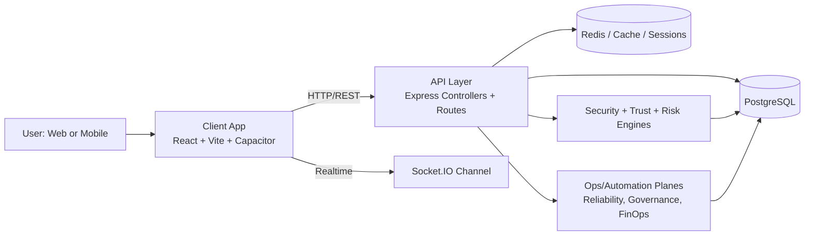

# MHub Platform Handbook

[](#build--runtime)
[](#frontend-architecture)
[](#backend-capability-map)
[](#data-foundation)
[](#quality-engineering--verification)

Last updated: 2026-03-23

## Why This README Exists

This document is the platform-grade, implementation-aware handbook for MHub.

It is designed to be:
- **Executive-readable**: clear product and system story.
- **Developer-ready**: direct paths to capabilities and scripts.
- **Audit-friendly**: explicit about implemented features, partials, and known gaps.
- **Source-control disciplined**: every meaningful change should update this handbook.

---

## Table of Contents

1. [Platform Vision](#platform-vision)
2. [What MHub Is Today](#what-mhub-is-today)
3. [Architecture at a Glance](#architecture-at-a-glance)
4. [Frontend Architecture](#frontend-architecture)
5. [Backend Capability Map](#backend-capability-map)
6. [Data Foundation](#data-foundation)
7. [Feature-by-Feature Deep Dive](#feature-by-feature-deep-dive)
8. [Quality Engineering & Verification](#quality-engineering--verification)
9. [Build & Runtime](#build--runtime)
10. [Known Gaps, Risks, and Technical Debt](#known-gaps-risks-and-technical-debt)
11. [Roadmap: What We Handle Next](#roadmap-what-we-handle-next)
12. [Security, Trust, and Compliance Notes](#security-trust-and-compliance-notes)
13. [Engineering Standards & Source Control Discipline](#engineering-standards--source-control-discipline)
14. [World-Class Repository References](#world-class-repository-references)
15. [Appendix: Command Cheat Sheet](#appendix-command-cheat-sheet)

---

## Platform Vision

MHub is a **category-native marketplace platform** that behaves like multiple marketplace apps inside one product.

Users choose a category context, and the platform pivots UI, discovery flows, and listing behavior around that choice. The long-term architecture supports not only commerce, but also trust operations, telemetry, automation, and operational governance.

## What MHub Is Today

### Strength Snapshot

- Rich marketplace and social-discovery surfaces are implemented.
- Security and auth foundations are strong (MFA, OTP, passkey support, rate-limiting layers).
- DevOps/testing maturity is higher than typical app-stage products (critical path tests, e2e smoke tests, contract probes).
- Subscription, referral, rewards, and tiering logic are active and extensible.

### Current Reality Check

- Some UX surfaces are operational but not yet management-grade (notifications, wishlist, recently viewed).
- Cart is still local-first and not yet commerce-trust complete.
- Documentation and code have occasional drift; this README is intended to reduce that drift.

---

## Architecture at a Glance



---

## Frontend Architecture

### Core Stack

- React 18 + Vite
- React Router
- TanStack Query
- Tailwind CSS + Radix UI primitives
- Socket.IO client
- Capacitor (Android/iOS bridge)
- i18next localization stack

### Frontend Zones

| Zone | Purpose | Primary Surfaces |
| --- | --- | --- |
| Marketplace Discovery | Browse and filter posts | `AllPosts`, `FeedPage`, `CategoryHub` |
| Listing Lifecycle | Create and manage listings | `AddPost`, `MyHome` |
| Trust & Identity UX | Profile and verification | `Profile`, `KYC` surfaces |
| Commerce UX | Cart, sale outcomes, checkout-adjacent flows | `Cart`, `SaleDone`, `SaleUndone` |
| Engagement & Retention | Notifications, wishlist, recently viewed, rewards | `Notifications`, `Wishlist`, `RecentlyViewed`, `RewardsPage` |
| Platform Access | Auth, security settings, guarded routes | Auth pages, `SecuritySettings`, protected routing |

### UX Architecture Notes

- Category mode and subcategory behavior are central to navigation and filtering.
- Realtime capabilities exist but not all UI surfaces fully consume live events yet.
- Multiple utility layers exist for formatting, avatar color identity, relative time, and expandable content.

---

## Backend Capability Map

### Runtime Stack

- Node.js + Express 5
- PostgreSQL (`pg`)
- Redis (`ioredis`) for caching/session patterns
- Socket.IO for realtime channels

### Capability Domains

| Domain | What Exists |
| --- | --- |
| Auth & Session Security | OTP, 2FA, passkeys/WebAuthn, lockout and session controls |
| Posts & Discovery | Listing CRUD, search/filter, recommendations and feed shaping |
| Commerce | Sale state handling, transaction services, subscription billing logic |
| Trust & Safety | KYC modules, complaint/review/moderation, security operations |
| Platform Intelligence | Telemetry ingest/replay, automation rules, alert intelligence |
| Fleet/Ops Planes | Reliability, governance, operator workflows, FinOps controls |

### Backend Organization Pattern

- `routes/` for surface-level API contracts
- `controllers/` for request/response handling
- `services/` for business logic and integrations
- `middleware/` for security, policy, and cross-cutting controls
- `database/migrations/` for schema and backfill evolution

---

## Data Foundation

### Core Entities

- `users`: identity, trust flags, referral lineage, profile state.
- `posts`: listing metadata, geo, tier, status, engagement counters, expiry.
- `categories` + `subcategories`: category-native marketplace partitioning.
- supporting entities: transactions, notifications, subscriptions, sessions, and ops logs.

### Important Data Notes

- Seed data and test data have historically dominated data volume; realism backfills were added.
- Migration safety patterns are mostly idempotent (`IF EXISTS` / `IF NOT EXISTS`) and intended to be rerunnable.

---

## Feature-by-Feature Deep Dive

### 1) Category-Native Marketplace (Core Differentiator)

**Implemented:**
- Category and subcategory-aware browsing and filtering are implemented.
- Add-post and feed surfaces are aware of category mode.
- Search behavior is category-scoped.

**Outcome:**
- MHub behaves more like a portfolio of focused category apps than one generic feed.

**Open work:**
- Continue clarifying backlog boundaries between `/feed` (community) and `/all-posts` (marketplace discovery).

### 2) Feed & Discovery Surfaces

**Implemented:**
- Refresh, retry, load-more mechanics and feed metadata handling are present.
- End-of-feed and skeleton/loading patterns are available.

**Open work:**
- Large-list virtualization is still pending for very high-volume performance scenarios.

### 3) Listings & Seller Workflow

**Implemented:**
- Listing creation flow, seller home/dashboard tabbing, and post lifecycle transitions are present.
- Sale-complete and sale-undo pathways exist.

**Open work:**
- Success/history states need stronger trust details (transaction evidence and post-status confirmations).

### 4) Notifications

**Implemented:**
- Notification infrastructure and delivery primitives exist.

**Gap:**
- Notifications page still needs robust realtime list synchronization, pagination, grouping/searching, and optimistic rollback support.

### 5) Wishlist

**Implemented:**
- Save-list core and duplicate-save prevention exist.

**Gap:**
- Still lightweight; management actions (sort/filter/share, add-to-cart/buy-now, notes rendering, bulk actions) require expansion.

### 6) Recently Viewed

**Implemented:**
- Tracking and dedup behavior are already wired and healthier than earlier backlog assumptions.

**Gap:**
- UX controls remain pending: pagination, filter/sort, accessible view toggles, and cancellation behavior.

### 7) Cart & Checkout Trust

**Implemented:**
- Client-side cart prototype and local flow.

**Critical gap:**
- No server-backed source of truth for cart totals, stock checks, or price revalidation.

**Risk:**
- Multi-device continuity and transaction trust are currently insufficient for production-grade commerce.

### 8) Referral, Rewards, and Subscriptions

**Implemented:**
- Referral and rewards subsystems exist with coin/tier mechanics.
- Dynamic tier pricing and trial endpoints exist on backend.

**Gap:**
- Some UX surfacing is incomplete and should better expose dynamic pricing/trials across key pages.

### 9) Realtime Chat & Communication

**Implemented:**
- Chat routes and Socket.IO-based realtime communications infrastructure are present.

**Gap:**
- Continue strengthening room auth/authorization guarantees and observability around channel integrity.

### 10) PWA and Mobile Readiness

**Implemented:**
- Capacitor setup, PWA enhancement surfaces, and mobile-aware patterns are in place.

**Gap:**
- Continue expanding offline-first guarantees and install/update telemetry depth.

---

## Quality Engineering & Verification

### Test and Quality Stack

- Frontend: Vitest + Testing Library + Playwright smoke flows.
- Backend: Jest integration/e2e-style suites + critical path testing.
- Contract and readiness probes exist for schema, routes, and runtime behavior.

### Operational Quality Signals

- Production build pipelines and bundle checks are in place.
- Performance budget and UX smoke scripts exist client-side.
- Failover drills, backup drills, and rollout simulation scripts exist server-side.

### Current Quality Debt

- Documentation-state drift occasionally lags implementation-state.
- Some large/minified files increase risk and reduce safe refactor velocity.

---

## Build & Runtime

### Local Development

```bash
# Terminal 1: API server
cd ../server
npm install
npm run dev

# Terminal 2: client app
cd ../client
npm install
npm run dev
```

### Client Commands

```bash
npm run dev
npm run dev:fresh
npm run build
npm run lint
npm run test
npm run check:bundle-budget
npm run check:performance-budget
npm run check:no-hardcoded-localhost
npm run check:network-contract
npm run check:ux-smoke
npm run test:e2e:smoke
```

### Server Commands

```bash
npm run start
npm run dev
npm run test
npm run test:critical-paths
npm run test:e2e:journeys
npm run test:waf
npm run preflight:schema
npm run check:schema-contract
npm run check:route-contract
npm run check:foundation-contract
npm run check:runtime-contract
npm run check:page-flow-contract
npm run failover:tabletop
npm run failover:active-active
npm run backup:drill
```

### Runtime Notes

- In local dev, client prefers same-origin `/api` through Vite proxy to avoid avoidable CORS friction.
- Keep explicit API-origin forcing disabled unless intentionally testing cross-origin behavior.

---

## Known Gaps, Risks, and Technical Debt

This section intentionally lists unresolved realities, not marketing-only positives.

### Product Gaps (High Impact)

1. Cart is still local-first and lacks server truth for validated totals/stock.
2. Notifications UX needs reliability-grade realtime state management.
3. Wishlist and recently viewed need management features for real decision workflows.
4. Sale completion screens need richer trust evidence and transaction detail rendering.

### Security/Operational Risk Areas

1. Source control hygiene issues have existed (tracked dumps, temp files, backup directories).
2. Secret exposure risk in historical artifacts/history requires strict rotation and cleanup practices.
3. Certain backend modules need continued hardening for injection/race-condition/SSRF classes of risk.

### Engineering Debt

1. Some large/minified files slow safe iteration.
2. Legacy/stale doc claims can misdirect implementation effort.
3. Need stronger, automated README/update discipline per change set.

---

## Roadmap: What We Handle Next

### Phase 1: Commerce Integrity

- Build server-backed cart with canonical line items.
- Enforce stock and price revalidation at checkout boundaries.
- Add multi-device cart continuity and conflict resolution.

### Phase 2: Reliability UX on Engagement Surfaces

- Notifications: realtime sync + pagination + rollback-safe optimistic actions.
- Wishlist/Recently Viewed: bulk actions, filters, sorting, and decision-first UX.

### Phase 3: Trust-Surface Upgrade

- Expand SaleDone/SaleUndone confirmation payload and timeline evidence.
- Surface post-status truth and transaction metadata visibly in success/history UI.

### Phase 4: Performance and Refactor Safety

- Virtualize heavy lists.
- Continue reducing minified/high-risk files through safe modularization.
- Tighten contract tests around stateful user journeys.

### Phase 5: Documentation Governance

- Enforce README updates on any user-visible or API contract change.
- Keep implementation status tags current: `Implemented`, `Partial`, `Planned`, `Blocked`.

---

## Security, Trust, and Compliance Notes

### What Is Strong

- Mature auth foundation with argon2id, OTP controls, passkey support, and layered middleware.
- Structured rate-limiting and WAF-aligned controls.
- Correlation and operational scripting around reliability and governance.

### What Needs Continuous Hardening

- Secret management hygiene in repo/history.
- Input sanitization depth and injection guardrails in all dynamic query paths.
- Socket/channel authorization strictness and abuse monitoring.

---

## Engineering Standards & Source Control Discipline

### Documentation Contract (Mandatory)

Every feature or bugfix PR should update this README when it changes:
- behavior,
- architecture,
- commands,
- risk posture,
- or roadmap status.

### Minimal Update Checklist Per Change

1. Add/adjust feature status in the relevant section.
2. Update command or script references if tooling changed.
3. Update gaps/risks if resolved or newly discovered.
4. Add a short dated note in the change log section below.

### Change Log (Documentation Layer)

| Date | Documentation Update |
| --- | --- |
| 2026-03-23 | Rebuilt README into platform handbook format with detailed features, risk register, and phased roadmap. |

---

## World-Class Repository References

The following repositories are strong standards references for architecture, quality discipline, and documentation style:

- [React](https://github.com/facebook/react) — component architecture and ecosystem discipline.
- [Vite](https://github.com/vitejs/vite) — modern frontend tooling and DX standards.
- [Express](https://github.com/expressjs/express) — server framework conventions.
- [Node.js](https://github.com/nodejs/node) — runtime engineering and governance.
- [PostgreSQL](https://github.com/postgres/postgres) — database reliability and evolution quality.
- [Redis](https://github.com/redis/redis) — cache and data-structure performance primitives.
- [Kubernetes](https://github.com/kubernetes/kubernetes) — large-scale ops patterns and control planes.
- [Next.js](https://github.com/vercel/next.js) — production web architecture and docs quality.
- [Django](https://github.com/django/django) — security-conscious framework design and documentation rigor.

Use these as inspiration for:
- contribution quality bars,
- release discipline,
- docs architecture,
- and testing governance.

---

## Appendix: Command Cheat Sheet

### Fast Daily Flow

```bash
# server
cd ../server && npm run dev

# client
cd ../client && npm run dev
```

### Verify Before PR

```bash
# client checks
npm run lint
npm run test
npm run build
npm run check:bundle-budget
npm run check:performance-budget
npm run check:ux-smoke

# server checks
npm run test
npm run test:critical-paths
npm run test:waf
npm run preflight:schema
npm run check:schema-contract
npm run check:route-contract
```

---

## Final Note

MHub has strong momentum and unusually broad capability for its stage. The path to world-class execution is now less about adding random features and more about finishing reliability, trust, and documentation discipline across every user-critical journey.
