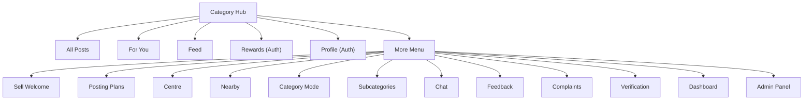
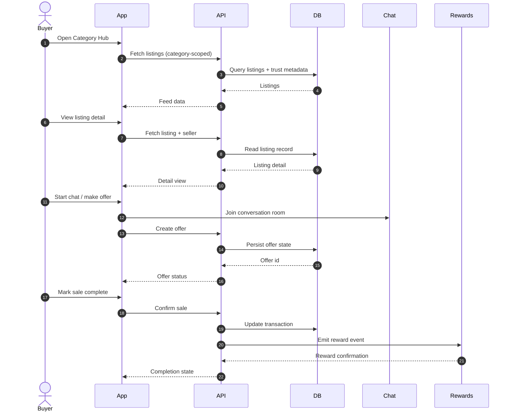
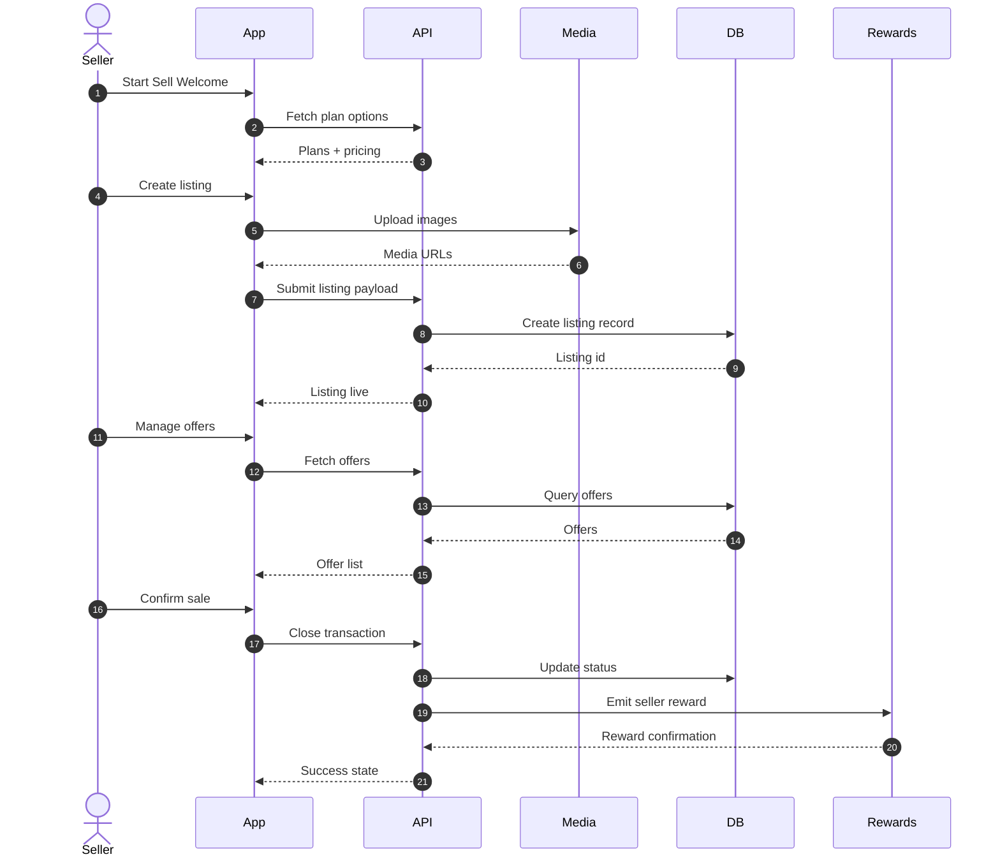
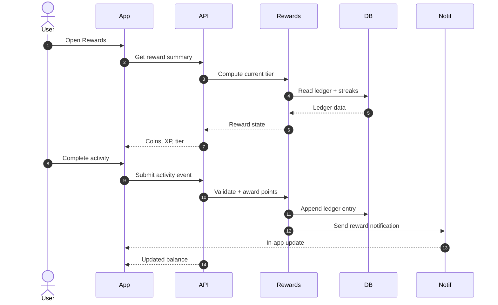

<p align="center">
  
</p>

<h1 align="center">MHub</h1>

<p align="center">
  <strong>The Category-Native Marketplace Platform</strong><br/>
  <em>One app. Every category. Every community.</em>
</p>

<p align="center">
  <a href="#-quick-start"></a>
  <a href="#-architecture"></a>
  <a href="#-features"></a>
  <a href="#-api-reference"></a>
</p>

<p align="center">
  
  
  
  
  
  
  
  
  
  
</p>

<p align="center">
  
  
  
  
  
</p>

---

<details>
<summary><strong>📑 Table of Contents</strong> <em>(click to expand)</em></summary>

### Foundation
- [Platform Vision](#-platform-vision)
- [Quick Start](#-quick-start)
- [Tech Stack](#-tech-stack)
- [Architecture](#-architecture)

### Application
- [Features](#-features)
- [Page Directory (All 67 Routes)](#-page-directory--all-67-routes)
- [App Flow Atlas (User + Developer Lens)](#-app-flow-atlas-user--developer-lens)
- [Product + Engineering Handbook (Printable Layout)](#-product--engineering-handbook-printable-layout)
- [Navigation Architecture](#-navigation-architecture)
- [Authentication & Access Control](#-authentication--access-control)

### Backend
- [API Reference](#-api-reference)
- [Database Schema](#-database-schema)
- [Middleware Pipeline](#-middleware-pipeline)
- [Service Layer](#-service-layer)

### Frontend
- [Component Library](#-component-library)
- [State Management](#-state-management)
- [Theming & Design System](#-theming--design-system)
- [Internationalization](#-internationalization)

### Platform
- [Rewards & Gamification System](#-rewards--gamification-system)
- [Trust & Safety Engine](#-trust--safety-engine)
- [Realtime Infrastructure](#-realtime-infrastructure)
- [Mobile & PWA](#-mobile--pwa)

### Operations
- [Testing Strategy](#-testing-strategy)
- [Scripts & Automation](#-scripts--automation)
- [Environment Configuration](#-environment-configuration)
- [Security Architecture](#-security-architecture)
- [Performance & Optimization](#-performance--optimization)

### Reference
- [World-Class Repo Inspirations](#-world-class-repo-inspirations)
- [Roadmap](#-roadmap)
- [Contributing](#-contributing)
- [Changelog](#-changelog)

</details>

---

## 🌟 Platform Vision

> **MHub is a category-native marketplace** that behaves like multiple specialized marketplace apps inside a single product.

Unlike generic classifieds where all categories live in one undifferentiated feed, MHub pivots its entire UI — discovery, filters, recommendations, and seller flow — based on the user's chosen category context. This makes buying electronics feel different from buying fashion, which feels different from browsing real estate.

### For Users
- **Browse** thousands of listings across categories with intelligent discovery
- **Sell** with a guided posting flow, tier-based visibility, and seller analytics
- **Earn** coins & rewards through daily activity, referrals, and streaks
- **Trust** — every seller has a computed trust score, verification badges, and review history
- **Chat** — real-time messaging with buyers and sellers
- **Save** — wishlists, saved searches, recently viewed, and price alerts

### For Developers
- **67 distinct routes** across marketplace, social, commerce, and admin surfaces
- **60+ API route files** covering auth, commerce, trust, gamification, and platform ops
- **40+ security middleware** layers from WAF to device binding to zero-trust
- **55+ backend services** spanning fraud detection to fleet orchestration
- **100+ reusable components** built on Radix UI + Tailwind primitives
- **26 languages** with full i18n infrastructure
- **Full-stack type safety** via consistent API contracts and validation

---

## 🚀 Quick Start

### Prerequisites

| Tool | Version | Purpose |
|------|---------|---------|
| **Node.js** | ≥ 18.x | Runtime |
| **PostgreSQL** | ≥ 15 | Database |
| **Redis** | ≥ 7.x | Cache & sessions |
| **npm** | ≥ 9.x | Package manager |

### 1. Clone & Install

```bash
git clone https://github.com/your-org/mhub.git
cd mhub

# Install server dependencies
cd server
cp .env.example .env        # Configure your database credentials
npm install

# Install client dependencies
cd ../client
npm install
```

### 2. Database Setup

```bash
cd server

# Run the complete schema setup
node run_migration.js

# Seed sample data (optional)
npm run seed:sample-data
```

### 3. Start Development

```bash
# Terminal 1 — API Server (port 5001)
cd server
npm run dev

# Terminal 2 — Client App (port 5173)
cd client
npm run dev
```

### 4. Open in Browser

```
http://localhost:5173
```

### Quick Verify

```bash
# Client build check
cd client && npm run build

# Server test suite
cd server && npm test

# Schema validation
cd server && npm run preflight:schema
```

---

## 🧱 Tech Stack

### Client Application

| Technology | Role | Why |
|------------|------|-----|
| **React 18** | UI framework | Component model, concurrent features, ecosystem |
| **Vite 5** | Build tool | Sub-second HMR, optimized production builds |
| **React Router 6** | Navigation | Nested routes, lazy loading, auth guards |
| **TanStack Query 5** | Server state | Cache, refetch, infinite scroll, optimistic updates |
| **Tailwind CSS 3.4** | Styling | Utility-first, dark mode, responsive, design tokens |
| **Radix UI** | Primitives | Accessible dialog, dropdown, tabs, toast, switch |
| **Lucide React** | Icons | Consistent, tree-shakeable icon library |
| **Socket.IO Client** | Realtime | Bidirectional communication for chat & notifications |
| **Capacitor 8** | Native bridge | Android/iOS with native GPS, contacts, push |
| **i18next** | Internationalization | 26 languages with lazy loading & localStorage cache |
| **Axios** | HTTP client | Interceptors, token refresh, CSRF, abort controllers |

### Server Application

| Technology | Role | Why |
|------------|------|-----|
| **Express 5** | HTTP framework | Mature, middleware-driven, async/await native |
| **PostgreSQL 17** | Database | ACID, JSONB, full-text search, CTEs, triggers |
| **Redis (ioredis)** | Cache layer | Session store, rate limiting, cache invalidation |
| **Socket.IO 4** | Realtime server | Room-based events, reconnection, acknowledgments |
| **Argon2 + bcrypt** | Password hashing | Dual-algo support, memory-hard hashing |
| **JWT + Refresh** | Token auth | Short-lived access + long-lived refresh rotation |
| **SimpleWebAuthn** | Passkeys/WebAuthn | Passwordless auth, FIDO2 standard |
| **Sharp** | Image processing | Resize, compress, format conversion |
| **Cloudinary** | Media CDN | Image hosting, transformation, optimization |
| **Helmet** | Security headers | CSP, HSTS, X-Frame, referrer policy |
| **Web Push** | Notifications | Push notifications via VAPID protocol |
| **Pusher** | Realtime events | Backup channel for critical event delivery |

### Infrastructure & Tooling

| Tool | Purpose |
|------|---------|
| **Vitest** | Frontend unit & integration testing |
| **Jest** | Backend testing with critical path coverage |
| **Playwright** | End-to-end browser testing (smoke & visual) |
| **ESLint** | Code quality enforcement |
| **PostCSS** | CSS processing pipeline |
| **PM2** | Production process management |
| **Nginx** | Reverse proxy & static serving |

---

## 🏗 Architecture

### System Overview

```
┌─────────────────────────────────────────────────────────────────────┐
│                         USER DEVICES                                │
│           Web Browser  ·  Android (Capacitor)  ·  PWA              │
└──────────────────────────────┬──────────────────────────────────────┘
                               │
                    ┌──────────┴──────────┐
                    │   CLIENT APP        │
                    │   React + Vite      │
                    │   67 Routes         │
                    │   100+ Components   │
                    │   6 Context Providers│
                    └──────────┬──────────┘
                               │
              ┌────────────────┼────────────────┐
              │ HTTP/REST      │ WebSocket       │ Push
              │ (Axios)        │ (Socket.IO)     │ (FCM/VAPID)
              │                │                 │
    ┌─────────┴─────────┐  ┌──┴──────────┐  ┌──┴──────────┐
    │   EXPRESS API      │  │  REALTIME   │  │   PUSH      │
    │   60+ Route Files  │  │  ENGINE     │  │   SERVICE   │
    │   46 Controllers   │  │  Chat/Notif │  │   FCM/Web   │
    │   40+ Middleware   │  │  Rewards SSE│  │   Push      │
    │   55+ Services     │  └─────────────┘  └─────────────┘
    └─────────┬─────────┘
              │
    ┌─────────┼──────────────────────┐
    │         │                      │
┌───┴───┐ ┌──┴────┐ ┌───────────────┴─────────────────┐
│Postgre│ │ Redis │ │ External Services                │
│  SQL  │ │       │ │ Cloudinary · Aadhaar · Payments  │
│ 20+   │ │ Cache │ │ FCM · VAPID · Geolocation        │
│Tables │ │Session│ │                                   │
└───────┘ └───────┘ └─────────────────────────────────────┘
```

### Frontend Architecture

```
client/src/
├── App.jsx                 # Root: Router + Providers + 67 Routes
├── main.jsx                # Entry: React DOM + i18n bootstrap
├── index.css               # Global styles + theme imports
│
├── pages/                  # 60+ page-level components
│   ├── AllPosts.jsx        # Discovery feed
│   ├── PostDetail.jsx      # Listing detail
│   ├── Profile.jsx         # User account (4 tabs)
│   ├── Rewards.jsx         # Gamification hub
│   ├── Chat.jsx            # Realtime messaging
│   └── ...
│
├── components/             # 100+ reusable UI components
│   ├── GreenNavbar.jsx     # Primary navigation (top + bottom)
│   ├── GreenProductCard.jsx# Listing card
│   ├── RequireAuth.jsx     # Auth guard HOC
│   ├── ui/                 # Radix UI primitives (shadcn)
│   ├── rewards/            # Rewards section components
│   ├── legal/              # Legal page components
│   └── page-state/         # Loading/Error/Empty states
│
├── context/                # 6 React Context providers
│   ├── AuthContext.jsx     # Auth state, login, logout, refresh
│   ├── CartContext.jsx     # Shopping cart state
│   ├── CategoryModeContext.jsx  # Category app mode
│   ├── FilterContext.jsx   # Global filter state
│   ├── LocationContext.jsx # GPS & location state
│   └── ThemeContext.jsx    # Dark/light/system theme
│
├── hooks/                  # 18 custom hooks
│   ├── useNotifications.js # TanStack Query notification hooks
│   ├── useRealtimeChat.js  # Socket.IO chat integration
│   ├── useTrustScore.js    # Trust badge computation
│   ├── useInfiniteScroll.js# Pagination hook
│   └── ...
│
├── services/               # Client-side service layer
│   ├── api.js              # Axios instance + interceptors
│   ├── vpnDetection.js     # VPN/proxy detection
│   ├── deviceFingerprint.js# Browser fingerprinting
│   └── nativeGpsService.js # Capacitor GPS bridge
│
├── utils/                  # 25 utility modules
│   ├── authStorage.js      # Token & session helpers
│   ├── savedPosts.js       # Wishlist local state
│   ├── formatPrice.js      # ₹ currency formatting
│   ├── relativeTime.js     # "2 hours ago" formatting
│   └── ...
│
├── lib/                    # Core library integrations
│   ├── socket.js           # Socket.IO client setup
│   ├── firebase.js         # FCM integration
│   ├── pushService.js      # Web Push subscription
│   └── requestSecurity.js  # Hardened request headers
│
├── styles/                 # Theme & design tokens
│   └── themes/
│       ├── light-theme.css # 100+ CSS variable tokens
│       ├── dark-theme.css  # Dark palette tokens
│       ├── dark-overrides.css
│       └── dark-comprehensive.css
│
├── locales/                # i18n translation files
│   └── en.json             # 1,250+ translation keys
│
├── constants/              # App constants
│   ├── languages.js        # 26 supported languages
│   └── categoryIcons.js    # Category → icon mapping
│
└── i18n/                   # i18n configuration
    └── index.js            # i18next setup with backends
```

### Backend Architecture

```
server/src/
├── index.js                # Express app + route mounting + Socket.IO
│
├── routes/                 # 60+ API route files
│   ├── auth.js             # /api/auth/*
│   ├── posts.js            # /api/posts/*
│   ├── chat.js             # /api/chat/*
│   ├── rewards.js          # /api/rewards/*
│   ├── coins.js            # /api/coins/*
│   ├── notifications.js    # /api/notifications/*
│   ├── payments.js         # /api/payments/*
│   └── ...                 # 53 more route files
│
├── controllers/            # 46 controller files
│   ├── authController.js   # Auth logic (login, signup, OTP, passkeys)
│   ├── postController.js   # CRUD + search + boost
│   ├── chatController.js   # Conversations + messages
│   ├── rewardsController.js# Points, tiers, leaderboard
│   ├── coinController.js   # Coin economy (spin, checkin, scratch)
│   └── ...
│
├── services/               # 55+ business logic services
│   ├── rewardsLedgerService.js     # Idempotent point mutations
│   ├── referralChainRewards.js     # Multi-level referral chain
│   ├── streakRewardsService.js     # Visit/post streak tracking
│   ├── leaderboardRewardsService.js# Weekly leaderboard rewards
│   ├── trustScoreService.js        # Trust score computation
│   ├── fraudService.js             # Fraud detection
│   ├── riskEngine.js               # Risk scoring engine
│   └── ...
│
├── middleware/              # 40+ middleware layers
│   ├── auth.js             # JWT verification
│   ├── rbac.js             # Role-based access control
│   ├── wafEnforcement.js   # Web application firewall
│   ├── vpnBlocker.js       # VPN/proxy blocking
│   ├── deviceBinding.js    # Session-device pinning
│   ├── zeroTrust.js        # Zero-trust verification
│   └── ...
│
├── utils/                  # Database helpers, logger, etc.
│   ├── dbHelpers.js        # Pool, query timeouts, helpers
│   └── logger.js           # Structured logging
│
└── worker/                 # Background job processing
```

---

## 🎯 Features

### Feature Matrix

| Category | Feature | Status | Auth | Route |
|:---------|:--------|:------:|:----:|:------|
| **Discovery** | | | | |
| | Category Hub (Home) | ✅ | — | `/category-hub` |
| | All Posts Feed | ✅ | — | `/all-posts` |
| | Personalized For You | ✅ | — | `/for-you` |
| | Community Feed | ✅ | — | `/feed` |
| | Nearby Listings | ✅ | 🔒 | `/nearby` |
| | Global Search | ✅ | — | `/search` |
| | Public Wall | ✅ | — | `/public-wall` |
| | Home Discovery | ✅ | — | `/home` |
| **Listings** | | | | |
| | Listing Detail | ✅ | — | `/post/:id` |
| | Add Post (Sell) | ✅ | 🔒 | `/add-post` |
| | Quick Post | ✅ | 🔒 | `/post_add` |
| | Feed Post | ✅ | 🔒 | `/feed/feedpostadd` |
| | Edit Post | ✅ | 🔒 | `/edit-post/:postId` |
| | My Posts | ✅ | 🔒 | `/my-home` |
| | Seller Dashboard | ✅ | 🔒 | `/dashboard` |
| **Commerce** | | | | |
| | Cart | ✅ | 🔒 | `/cart` |
| | Wishlist | ✅ | 🔒 | `/wishlist` |
| | Offers | ✅ | — | `/offers` |
| | Buy History | ✅ | 🔒 | `/bought-posts` |
| | Sell History | ✅ | 🔒 | `/sold-posts` |
| | Sale Complete | ✅ | 🔒 | `/saledone` |
| | Sale Undo | ✅ | 🔒 | `/saleundone` |
| | Buyer View | ✅ | 🔒 | `/buyer-view` |
| **Social** | | | | |
| | Realtime Chat | ✅ | 🔒 | `/chat` |
| | Channels | ✅ | — | `/channels` |
| | Centre Pages | ✅ | 🔒 | `/centre` |
| | Activity Hub | ✅ | 🔒 | `/activity` |
| | Reviews | ✅ | — | `/reviews/:userId` |
| | My Feed | ✅ | 🔒 | `/my-feed` |
| **Rewards** | | | | |
| | Rewards Dashboard | ✅ | 🔒 | `/rewards` |
| | Daily Check-in | ✅ | 🔒 | API |
| | Spin the Wheel | ✅ | 🔒 | API |
| | Scratch Cards | ✅ | 🔒 | API |
| | Referral Chain | ✅ | 🔒 | API |
| | Streak Bonuses | ✅ | 🔒 | API |
| | Leaderboard | ✅ | 🔒 | API |
| | Tier System | ✅ | 🔒 | API |
| **Account** | | | | |
| | Profile (4 tabs) | ✅ | 🔒 | `/profile` |
| | Notifications | ✅ | 🔒 | `/notifications` |
| | Security Settings | ✅ | 🔒 | `/security` |
| | Payments | ✅ | 🔒 | `/payment` |
| | KYC Verification | ✅ | 🔒 | `/kyc` |
| | Aadhaar Verify | ✅ | 🔒 | `/aadhaar-verify` |
| | Posting Plans | ✅ | 🔒 | `/tier-selection` |
| **Admin** | | | | |
| | Admin Panel | ✅ | 🔒👑 | `/admin-panel` |
| | Analytics | ✅ | — | `/analytics` |
| | Seller Analytics | ✅ | 🔒 | API |

> 🔒 = Requires authentication &nbsp;&nbsp; 👑 = Requires admin role &nbsp;&nbsp; ✅ = Implemented

---

### 1. Category-Native Marketplace

> *The core differentiator — MHub pivots its entire experience based on category context.*

```
User selects "Electronics" → UI shows tech-optimized filters, specs,
  price comparisons, and electronics-specific discovery

User switches to "Fashion" → UI pivots to size filters, style
  recommendations, and fashion-optimized card layouts
```

**Key Behaviors:**
- **Category Mode Selector** — Full-screen mode picker at `/category-mode`
- **Scoped Filtering** — Search, price range, subcategories, and condition filters scope to active category
- **Cart Scoping** — Cart badge reflects items in current category context
- **Feed Scoping** — Discovery feeds filter by active category mode
- **Persistent Selection** — Category mode persists across sessions via localStorage

**Technical Implementation:**
- `CategoryModeContext` provides `activeApp`, `activeCategory`, and `categories` to all components
- `categoryModeFilters.js` utility builds matchers for filtering posts by active mode
- `GreenNavbar` dynamically adjusts subcategory dropdowns per category
- All API calls include category mode as query parameter via Axios interceptor

---

### 2. Discovery & Search

> *Multiple discovery surfaces ensure users find what they need, however they browse.*

| Surface | Description | Key Feature |
|---------|-------------|-------------|
| **Category Hub** | Grid of all categories with stats | Hub stats, trending sections |
| **All Posts** | Infinite-scroll listing feed | Sort, filter, condition, price range |
| **For You** | ML-powered recommendations | Preference-aware, personalized |
| **Feed** | Community/social activity stream | Posts, updates, engagement |
| **Nearby** | Location-based discovery | GPS radius, distance display |
| **Search** | Global text search | Cross-category, instant results |
| **Public Wall** | Social proof surface | Top sellers, buyers, activity |

**Search & Filter Capabilities:**
- Text search with debouncing
- Price range (min/max)
- Condition filter (New, Like New, Good, Fair)
- Subcategory scoping
- Location-based filtering
- Verified sellers only toggle
- Sort by: newest, price low/high, relevance
- Infinite scroll with `useInfiniteScroll` hook

---

### 3. Listing & Seller Workflow

> *From posting to sale completion — a full listing lifecycle.*

```
Sell Welcome → Add Post → My Posts → Offers → Sale Done
     │              │          │                  │
     â–¼              â–¼          â–¼                  â–¼
  Guide &      Multi-image   Manage &        Transaction
  tier info    upload, GPS   boost, edit      stepper
               auto-location
```

**Post Creation:**
- Multi-image upload with compression (`browser-image-compression`)
- Server-side image optimization (`sharp`)
- CDN hosting via Cloudinary
- GPS auto-location detection
- Category & subcategory selection
- Condition, price, description, and contact info
- Draft saving and edit capability

**Seller Tools:**
- **My Posts** (`/my-home`) — View, edit, delete, boost listings
- **Dashboard** (`/dashboard`) — Sales analytics, view counts, engagement
- **Seller Analytics** — Revenue tracking, performance metrics
- **Post Boost** — Visibility enhancement via coin spending
- **Guaranteed Reach** — Premium visibility tier

---

### 4. Commerce & Transactions

> *End-to-end transaction flow from interest to completion.*

| Step | Component | Description |
|------|-----------|-------------|
| 1 | **Buyer Interest** | Buyer sends interest via `BuyerInterestModal` |
| 2 | **Offer** | Price negotiation through `MakeOfferModal` |
| 3 | **Chat** | Real-time negotiation via Socket.IO |
| 4 | **Sale Done** | Seller marks complete with `TransactionStepper` |
| 5 | **Sale Undo** | Revert if needed with audit trail |
| 6 | **Review** | Post-transaction rating at `/reviews/:userId` |

**Cart System:**
- Add to cart from listing detail
- Category-scoped cart count in navbar
- `MiniCartPopover` for quick overview
- Quantity management
- Price subtotals

**Transaction History:**
- **Bought Posts** — All purchases with status tracking
- **Sold Posts** — All sales with revenue summary
- **Buyer View** — Buyer-centric interface for active transactions

---

### 5. Chat & Messaging

> *Real-time communication powered by Socket.IO with typing indicators and online presence.*

**Features:**
- 1-on-1 conversations between buyers and sellers
- Real-time message delivery via WebSocket
- Typing indicators with debouncing
- Online/offline presence tracking
- Message history with infinite scroll
- Audio recording capability (`AudioRecorder` component)
- Push notification fallback for offline users

**Technical Stack:**
- `Socket.IO` with token-authenticated connections
- `useRealtimeChat` hook for UI integration
- Room-based architecture (`user_{id}` channels)
- Reconnection with exponential backoff
- Server-side message persistence in PostgreSQL

---

### 6. User Profile System

> *Rich profile with 4 tabs covering every aspect of the user account.*

```
/profile
├── ?tab=overview     # Activity summary, trust score, stats
├── ?tab=personal     # Name, email, phone, avatar
├── ?tab=preferences  # Category preferences, notifications, language
└── ?tab=settings     # Privacy, security, data export, delete
```

**Profile Features:**
- Avatar with intelligent color generation (`avatarColor.js`)
- Trust score display with badge (Verified/New/Risky)
- Activity statistics (listings, sales, purchases)
- Verification status indicator
- Edit personal information
- Notification preference management
- Language selection (26 languages)
- Privacy controls and data management

---

### 7. Notifications System

> *Multi-channel notification delivery with real-time updates.*

**Channels:**
| Channel | Technology | Use Case |
|---------|-----------|----------|
| In-App | TanStack Query polling | Badge counts, notification list |
| WebSocket | Socket.IO events | Instant delivery, chat messages |
| Web Push | VAPID/FCM | Background/offline notifications |
| Email | SMTP service | Critical alerts, password reset |

**In-App Notifications:**
- Unread count badge on navbar bell icon
- Paginated notification list at `/notifications`
- Mark as read (individual + bulk)
- Delete notifications
- Search and filter by type
- Optimistic updates via TanStack Query

---

## 📍 Page Directory — All 67 Routes

This is the authoritative navigation inventory used by product, QA, and engineering.

Auth legend: `🔒` = authenticated, `🔐` = authenticated + role, `—` = public.

### Primary Nav (Bottom Bar)

| # | Page | Route(s) | Auth | Description |
|:-:|:-----|:---------|:----:|:------------|
| 1 | **Category Hub** | `/category-hub` | — | Category landing / discovery home |
| 2 | **All Posts** | `/all-posts`, `/listings` | — | Product listing feed |
| 3 | **For You** | `/for-you` (alias: `/my-recommendations` → `/for-you`) | — | Personalized recommendations |
| 4 | **Feed** | `/feed` | — | Community/activity feed |
| 5 | **Rewards** | `/rewards` | 🔒 | Loyalty & gamification hub |
| 6 | **Profile** | `/profile` | 🔒 | User account hub |
| 7 | **More** | Hamburger menu | — | Secondary navigation drawer |

### Profile Tabs (Inside /profile)

| Tab | Route | Purpose |
|:----|:------|:--------|
| Overview | `/profile?tab=overview` | Snapshot of profile health, completion, and quick actions |
| Personal | `/profile?tab=personal` | Personal information and identity fields |
| Preferences | `/profile?tab=preferences` | Discovery preferences, category interests, and filters |
| Settings | `/profile?tab=settings` | Security, notifications, language, and privacy settings |

### More Menu Pages (Secondary Navigation)

| # | Page | Route(s) | Auth | Description |
|:-:|:-----|:---------|:----:|:------------|
| 8 | **Sell Welcome** | `/post-welcome` | 🔒 | Start selling flow |
| 9 | **Posting Plans** | `/tier-selection`, `/tiers`, `/pricing` | 🔒 | Tier selection and pricing |
| 10 | **Centre** | `/centre` | 🔒 | Centre channel list |
| 11 | **Nearby** | `/nearby` | 🔒 | Nearby listings |
| 12 | **Category Mode** | `/category-mode` | — | App/category mode selector |
| 13 | **Subcategories** | `/subcategories`, `/categories` | — | Category browser |
| 14 | **Chat** | `/chat`, `/chats` | 🔒 | Messaging |
| 15 | **Feedback** | `/feedback` | 🔒 | Feedback form |
| 16 | **Complaints** | `/complaints` | 🔒 | Issue reporting |
| 17 | **Verification** | `/verification` | 🔒 | Verification entry point |
| 18 | **Dashboard** | `/dashboard` | 🔒 | Seller dashboard |
| 19 | **Admin Panel** | `/admin-panel` | 🔐 | Admin tools |

### Auth & Access

| # | Page | Route(s) | Description |
|:-:|:-----|:---------|:------------|
| 20 | **Login** | `/login` | Sign in |
| 21 | **Sign Up** | `/signup` | Create account |
| 22 | **Invite Redirect** | `/invite/:code` | Referral/invite handling |
| 23 | **Forgot Password** | `/forgot-password` | Password reset request |
| 24 | **Reset Password** | `/reset-password`, `/reset-password/:token` | Reset flow |

### Discovery & Search

| # | Page | Route(s) | Auth | Description |
|:-:|:-----|:---------|:----:|:------------|
| 25 | **Home Discovery** | `/home` | — | Curated discovery landing |
| 26 | **Activity Hub** | `/activity` | 🔒 | Shortcut hub (chat/offers/reviews/nearby) |
| 27 | **Public Wall** | `/public-wall` | — | Public listings/social wall |
| 28 | **Search** | `/search` | — | Global search |

### Listings & Post Flow

| # | Page | Route(s) | Auth | Description |
|:-:|:-----|:---------|:----:|:------------|
| 29 | **Listing Detail** | `/post/:id`, `/listing/:id` | — | Item detail view |
| 30 | **Add Post** | `/add-post`, `/sell` | 🔒 | Create listing form |
| 31 | **Quick Post** | `/post_add` | 🔒 | Alternate add-post flow |
| 32 | **Feed Post Add** | `/feed/feedpostadd` | 🔒 | Feed-only post creation (no image upload) |
| 33 | **Edit Post** | `/edit-post/:postId` | 🔒 | Edit listing |

### My Inventory & Transactions

| # | Page | Route(s) | Auth | Description |
|:-:|:-----|:---------|:----:|:------------|
| 34 | **My Posts** | `/my-home`, `/my-posts` | 🔒 | Manage your listings |
| 35 | **Bought Posts** | `/bought-posts` | 🔒 | Purchase history |
| 36 | **Sold Posts** | `/sold-posts` | 🔒 | Sold history |
| 37 | **Buyer View** | `/buyer-view` | 🔒 | Buyer-centric view |
| 38 | **Sale Done** | `/saledone` | 🔒 | Mark sale complete |
| 39 | **Sale Undone** | `/saleundone` | 🔒 | Revert sale |

### Feed & Social Extensions

| # | Page | Route(s) | Auth | Description |
|:-:|:-----|:---------|:----:|:------------|
| 40 | **Feed Detail** | `/feed/:id` | — | Feed post detail |
| 41 | **My Feed** | `/my-feed` | 🔒 | Personal feed |
| 42 | **Offers** | `/offers` | — | Transaction offers |
| 43 | **Reviews** | `/reviews/:userId` | — | User reviews/ratings |

### Commerce & Saved

| # | Page | Route(s) | Auth | Description |
|:-:|:-----|:---------|:----:|:------------|
| 44 | **Wishlist** | `/wishlist` | 🔒 | Saved items |
| 45 | **Cart** | `/cart` | 🔒 | Cart |
| 46 | **Recently Viewed** | `/recently-viewed` | 🔒 | Browsing history |
| 47 | **Saved Searches** | `/saved-searches` | 🔒 | Stored searches |

### Messaging & Channels

| # | Page | Route(s) | Auth | Description |
|:-:|:-----|:---------|:----:|:------------|
| 48 | **Channels** | `/channels` | — | Channel list |
| 49 | **Channel Create** | `/channels/create` | 🔒 | Create channel |
| 50 | **Channel Detail** | `/channels/:id` | — | Channel page |
| 51 | **Centre Create** | `/centre/create` | 🔒 | Create centre page |
| 52 | **Centre Detail** | `/centre/:id` | 🔒 | Centre page |
| 53 | **Centre Listings** | `/centre/:id/listings` | 🔒 | Centre listings |

### Account, Trust & Payments

| # | Page | Route(s) | Auth | Description |
|:-:|:-----|:---------|:----:|:------------|
| 54 | **Notifications** | `/notifications` | 🔒 | Notification center |
| 55 | **Security Settings** | `/security` | 🔒 | Account security |
| 56 | **Payment Methods** | `/payment` | 🔒 | Payments |
| 57 | **KYC Verification** | `/kyc` | 🔒 | KYC flow |
| 58 | **Aadhaar Verify** | `/aadhaar-verify` | 🔒 | Aadhaar verification |
| 59 | **Analytics** | `/analytics` | — | Analytics insights |

### Legal & Policies

| # | Page | Route(s) | Description |
|:-:|:-----|:---------|:------------|
| 60 | **Terms (Short)** | `/t&c` | Terms & conditions |
| 61 | **Terms** | `/terms`, `/terms-and-conditions` | Full terms & conditions |
| 62 | **Privacy Policy** | `/privacy-policy` | Privacy policy |
| 63 | **Refund Policy** | `/refund-policy` | Refund policy |
| 64 | **Support Ticket Policy** | `/support-ticket-policy` | Support ticket policy |

### Redirects & Fallbacks

| # | Route | Target | Description |
|:-:|:------|:-------|:------------|
| 65 | `/` | `/category-hub` | Root redirect |
| 66 | `/categories/:slug` | `/all-posts` | Category slug redirect |
| 67 | `*` | `/category-hub` | Not found fallback |

---

## 🧭 App Flow Atlas (User + Developer Lens)

This section documents end-to-end journeys in two voices: the **User View** (plain language) and the **Developer View** (implementation lens).

### Dual-Lens Summary

| User Language | Developer Language |
|:-------------|:-------------------|
| Discover items by category and intent. | Category mode state shapes filters, endpoints, and UI layouts. |
| See personalized picks that reflect interests. | Preferences + recommendation signals feed `/for-you`. |
| Trust sellers through verification and reputation. | Trust score, verification, and review services annotate listings. |
| Close transactions with clear states. | Offers + sale state changes create audit trails and ledger updates. |
| Stay engaged with rewards and streaks. | Rewards engine tracks events, streaks, and leaderboards. |

### Flow 1: Discover → Decide → Contact (Guest & Buyer)

| Step | User View | Pages | Developer View |
|:----:|:----------|:------|:---------------|
| 1 | Choose a category or mode. | `/category-hub`, `/category-mode` | Category mode drives filters and query scopes. |
| 2 | Browse the main feed. | `/all-posts`, `/listings` | Paginated post feed with filters and caching. |
| 3 | Explore personalized picks. | `/for-you` | Recommendation pipeline using preference snapshot. |
| 4 | Open a listing. | `/post/:id`, `/listing/:id` | Listing detail + media pipeline + trust badges. |
| 5 | Start a conversation or offer. | `/chat`, `/chats`, `/offers` | Socket.IO chat + offers state updates. |
| 6 | Complete or revert a sale. | `/saledone`, `/saleundone` | Transaction state changes with audit logging. |

### Flow 2: Sell → Manage → Close (Seller)

| Step | User View | Pages | Developer View |
|:----:|:----------|:------|:---------------|
| 1 | Start the selling journey. | `/post-welcome` | Onboarding and tier awareness entry point. |
| 2 | Choose a posting plan. | `/tier-selection`, `/tiers`, `/pricing` | Plan/tier gating for visibility and features. |
| 3 | Create a listing. | `/add-post`, `/sell`, `/post_add` | Listing creation, validation, media upload. |
| 4 | Track your listings. | `/my-home`, `/my-posts` | Seller inventory management and status. |
| 5 | Negotiate offers. | `/offers` | Offer lifecycle and transaction state. |
| 6 | Mark transactions complete. | `/saledone`, `/saleundone` | Sale confirmation and reversal with audit. |
| 7 | Build a premium presence. | `/centre`, `/centre/create`, `/centre/:id` | Centre page creation and premium branding. |

### Flow 3: Trust & Safety → Account Confidence

| Step | User View | Pages | Developer View |
|:----:|:----------|:------|:---------------|
| 1 | Create or sign in to an account. | `/signup`, `/login` | Auth pipelines, sessions, refresh tokens. |
| 2 | Verify identity. | `/verification`, `/kyc`, `/aadhaar-verify` | Verification providers + trust score updates. |
| 3 | Manage security settings. | `/security` | 2FA, passkeys, session controls. |
| 4 | Review reputation. | `/reviews/:userId` | Ratings and review aggregation. |
| 5 | Report issues. | `/complaints` | Complaint intake and escalation. |

### Flow 4: Rewards → Loyalty → Progression

| Step | User View | Pages | Developer View |
|:----:|:----------|:------|:---------------|
| 1 | Open rewards hub. | `/rewards` | Rewards ledger, coins, XP, tiers. |
| 2 | Track activity milestones. | `/activity` | Activity feed with rewardable events. |
| 3 | Receive updates. | `/notifications` | Reward notifications and streak reminders. |
| 4 | See progress on profile. | `/profile?tab=overview` | Completion percentage and next actions. |

### Flow 5: Community → Social Signal → Discovery

| Step | User View | Pages | Developer View |
|:----:|:----------|:------|:---------------|
| 1 | Browse community feed. | `/feed` | Feed ranking and engagement signals. |
| 2 | Deep dive into a post. | `/feed/:id` | Feed detail with comments and reactions. |
| 3 | Explore public activity. | `/public-wall` | Public visibility layer. |

### Flow 6: Support → Resolution

| Step | User View | Pages | Developer View |
|:----:|:----------|:------|:---------------|
| 1 | Send feedback. | `/feedback` | Feedback capture and tagging. |
| 2 | File a complaint. | `/complaints` | Issue workflow and investigation. |
| 3 | Review policies. | `/support-ticket-policy`, `/terms`, `/privacy-policy` | Legal and policy surfaces. |

### Flow 7: Admin & Operations

| Step | User View | Pages | Developer View |
|:----:|:----------|:------|:---------------|
| 1 | Access admin tools. | `/admin-panel` | Role-gated admin controls. |
| 2 | Monitor platform health. | `/analytics` | Admin and ops insights dashboards. |

### Navigation Graph (High Level)



## 📘 Product + Engineering Handbook (Printable Layout)

This layout is optimized for printing or PDF export while remaining readable in‑repo.

### Printable Cover Sheet

| Field | Value |
|:------|:------|
| Document | MHub Product + Engineering Handbook |
| Version | v2026.04.05 |
| Owners | Product + Engineering |
| Audience | Product, Engineering, QA, Ops |
| Scope | End‑to‑end app flows, navigation, architecture, trust, rewards |
| Classification | Internal |

**How to use this handbook:**
- Use the Page Directory for route coverage.
- Use the Sequence Diagrams and Acceptance Criteria for QA.
- Use the Page Specs for implementation alignment.

<div style="page-break-after: always;"></div>

### Print Guide

1. Use your browser’s print dialog and select “Save as PDF.”
2. Enable background graphics for consistent diagrams and tables.
3. Set scale to 90–95% for tighter page flow.
4. Prefer portrait orientation for tables; use landscape only for wide diagrams.

### Handbook Structure (At‑a‑Glance)

| Part | Audience | What You’ll Get |
|:-----|:---------|:----------------|
| Product Overview | Everyone | Platform vision, value proposition, and user promise |
| User Journeys | Product + QA | End‑to‑end flows and expected outcomes |
| Navigation + Pages | Product + Eng | Complete route inventory and purpose |
| System Architecture | Engineering | Frontend, backend, realtime, and data layout |
| Data + APIs | Engineering | Service boundaries, data contracts, and core endpoints |
| Trust + Safety | Product + Eng | Verification, risk, and safety controls |
| Rewards + Loyalty | Product + Eng | Gamification engine and user progression |
| Mobile + PWA | Engineering | Native capabilities and offline behavior |
| Operations | Engineering + QA | Testing, performance, and security posture |

<div style="page-break-after: always;"></div>

### End‑to‑End Sequence Diagrams

#### 1) Buy Flow — Discover → Decide → Contact → Complete



<div style="page-break-after: always;"></div>

#### 2) Sell Flow — Onboard → List → Manage → Close



<div style="page-break-after: always;"></div>

#### 3) Rewards Flow — Activity → Ledger → Progression



---

### Acceptance Criteria (Print‑Ready)

#### Buy Flow Acceptance Criteria

| ID | Scenario | Expected |
|:---|:---------|:---------|
| B1 | Open Category Hub | Categories and discovery shortcuts render with loading skeletons then data. |
| B2 | Apply category filters | Listing feed updates to category‑scoped results with correct counts. |
| B3 | Open listing detail | Gallery, price, seller, and trust indicators render without layout shift. |
| B4 | Start chat or offer (guest) | User is prompted to log in before message/offer submission. |
| B5 | Start chat or offer (auth) | Conversation or offer is created and visible in `/chat` or `/offers`. |
| B6 | Mark sale complete | Transaction state changes for both parties and appears in history. |
| B7 | Sale undone | Transaction reverts with audit trail; both users see updated state. |
| B8 | Network error | Friendly retry state appears; cached data stays visible when possible. |

#### Sell Flow Acceptance Criteria

| ID | Scenario | Expected |
|:---|:---------|:---------|
| S1 | Open Sell Welcome | Onboarding and plan guidance loads with CTA to start posting. |
| S2 | Select posting plan | Plan selection is persisted and reflected in listing privileges. |
| S3 | Create listing with images | Media uploads succeed and preview matches uploaded order. |
| S4 | Submit listing form | Validation errors are clear; successful submission redirects to listing. |
| S5 | Manage listings | `/my-home` shows new listing with correct status and analytics. |
| S6 | Review offers | Offers list reflects latest buyer offers and status changes. |
| S7 | Confirm sale | Listing status updates to sold and triggers reward event. |
| S8 | Create Centre page | Centre profile saves and appears on `/centre/:id`. |

#### Rewards Flow Acceptance Criteria

| ID | Scenario | Expected |
|:---|:---------|:---------|
| R1 | Open Rewards | Current coin balance, XP, tier, and streaks render correctly. |
| R2 | Daily check‑in | One check‑in per day; repeated attempts are idempotent. |
| R3 | Activity reward | Eligible actions add ledger entries with correct points. |
| R4 | Leaderboard update | Weekly refresh reflects new ranks without duplicates. |
| R5 | Reward notification | In‑app notification appears with correct balance delta. |
| R6 | Offline or error | Rewards view shows cached state and retry messaging. |

<div style="page-break-after: always;"></div>

### Page Specs (Condensed, Print‑Ready)

Each page below includes its intent, primary actions, and key states. This section complements the route inventory.

#### Primary Nav Specs

| Page | Route(s) | User Goal | Key Actions | Key States |
|:-----|:---------|:----------|:------------|:-----------|
| Category Hub | `/category-hub` | Choose discovery path | Browse categories, jump to feed | Loading, empty, error |
| All Posts | `/all-posts`, `/listings` | Browse listings | Filter, sort, open listing | Loading, empty, error |
| For You | `/for-you` | Personalized picks | Refresh, open listing | Loading, cold‑start, error |
| Feed | `/feed` | Community updates | Open post, react | Loading, empty, error |
| Rewards | `/rewards` | See rewards | Check‑in, view ledger | Loading, auth required, error |
| Profile | `/profile` | Manage account | Edit profile, navigate tabs | Loading, auth required, error |
| More | Hamburger | Reach secondary pages | Open drawer, navigate | Open, closed |

#### Profile Tab Specs

| Tab | Route | User Goal | Key Actions | Key States |
|:----|:------|:----------|:------------|:-----------|
| Overview | `/profile?tab=overview` | Snapshot health | Quick actions, completion tasks | Loading, empty, error |
| Personal | `/profile?tab=personal` | Edit profile | Update details, save | Editing, validation, saved |
| Preferences | `/profile?tab=preferences` | Set preferences | Update filters, save | Editing, saved |
| Settings | `/profile?tab=settings` | Configure account | Security, language, privacy | Loading, saved |

#### More Menu Specs

| Page | Route(s) | User Goal | Key Actions | Key States |
|:-----|:---------|:----------|:------------|:-----------|
| Sell Welcome | `/post-welcome` | Start selling | Begin posting flow | Loading, error |
| Posting Plans | `/tier-selection`, `/tiers`, `/pricing` | Choose plan | Compare plans, select | Loading, error |
| Centre | `/centre` | Manage centre pages | Open centre, create new | Loading, error |
| Nearby | `/nearby` | Find local listings | Enable GPS, browse | Permission, loading |
| Category Mode | `/category-mode` | Switch mode | Select category/app mode | Loading, error |
| Subcategories | `/subcategories`, `/categories` | Browse categories | Navigate subcategory tree | Loading, empty |
| Chat | `/chat`, `/chats` | Messaging | Open threads, send messages | Loading, empty |
| Feedback | `/feedback` | Send feedback | Submit form | Validation, success |
| Complaints | `/complaints` | Report issues | Submit complaint | Validation, success |
| Verification | `/verification` | Verify identity | Start verification flow | Loading, error |
| Dashboard | `/dashboard` | Seller analytics | View stats, manage listings | Loading, empty |
| Admin Panel | `/admin-panel` | Admin tools | Manage platform | Role‑gated, error |

#### Auth & Access Specs

| Page | Route(s) | User Goal | Key Actions | Key States |
|:-----|:---------|:----------|:------------|:-----------|
| Login | `/login` | Sign in | Password/OTP/passkey | Validation, error |
| Sign Up | `/signup` | Create account | Submit details, referral | Validation, success |
| Invite Redirect | `/invite/:code` | Apply referral | Redirect to signup | Invalid code |
| Forgot Password | `/forgot-password` | Reset request | Submit email | Success, error |
| Reset Password | `/reset-password`, `/reset-password/:token` | Set new password | Submit password | Invalid token |

#### Discovery & Search Specs

| Page | Route(s) | User Goal | Key Actions | Key States |
|:-----|:---------|:----------|:------------|:-----------|
| Home Discovery | `/home` | Curated discovery | Browse sections | Loading, empty |
| Activity Hub | `/activity` | Quick access | Jump to chat/offers/reviews | Loading, error |
| Public Wall | `/public-wall` | Public activity | Browse public listings | Loading, empty |
| Search | `/search` | Find items | Query, refine, open | Loading, empty |

#### Listings & Post Flow Specs

| Page | Route(s) | User Goal | Key Actions | Key States |
|:-----|:---------|:----------|:------------|:-----------|
| Listing Detail | `/post/:id`, `/listing/:id` | Evaluate item | View media, contact seller | Loading, not found |
| Add Post | `/add-post`, `/sell` | Create listing | Upload, submit | Validation, success |
| Quick Post | `/post_add` | Fast listing | Minimal fields, submit | Validation, success |
| Feed Post Add | `/feed/feedpostadd` | Create feed post | Compose, submit | Validation, success |
| Edit Post | `/edit-post/:postId` | Update listing | Edit fields, save | Validation, success |

#### My Inventory & Transactions Specs

| Page | Route(s) | User Goal | Key Actions | Key States |
|:-----|:---------|:----------|:------------|:-----------|
| My Posts | `/my-home`, `/my-posts` | Manage listings | Edit, pause, delete | Loading, empty |
| Bought Posts | `/bought-posts` | Track purchases | View status | Loading, empty |
| Sold Posts | `/sold-posts` | Track sales | View status | Loading, empty |
| Buyer View | `/buyer-view` | Buyer transactions | Review offers | Loading, error |
| Sale Done | `/saledone` | Confirm sale | Mark complete | Success, error |
| Sale Undone | `/saleundone` | Revert sale | Submit issue | Success, error |

#### Feed & Social Specs

| Page | Route(s) | User Goal | Key Actions | Key States |
|:-----|:---------|:----------|:------------|:-----------|
| Feed Detail | `/feed/:id` | View post | React, comment | Loading, not found |
| My Feed | `/my-feed` | Personal feed | Manage posts | Loading, empty |
| Offers | `/offers` | Manage offers | Accept, reject | Loading, empty |
| Reviews | `/reviews/:userId` | View reputation | Read reviews | Loading, empty |

#### Commerce & Saved Specs

| Page | Route(s) | User Goal | Key Actions | Key States |
|:-----|:---------|:----------|:------------|:-----------|
| Wishlist | `/wishlist` | Saved items | Remove, open | Loading, empty |
| Cart | `/cart` | Cart actions | Update quantity | Loading, empty |
| Recently Viewed | `/recently-viewed` | Recall items | Open listing | Loading, empty |
| Saved Searches | `/saved-searches` | Re‑run searches | Open, delete | Loading, empty |

#### Messaging & Channels Specs

| Page | Route(s) | User Goal | Key Actions | Key States |
|:-----|:---------|:----------|:------------|:-----------|
| Channels | `/channels` | Browse channels | Open channel | Loading, empty |
| Channel Create | `/channels/create` | Create channel | Submit details | Validation, success |
| Channel Detail | `/channels/:id` | View channel | Join, view content | Loading, not found |
| Centre Create | `/centre/create` | Create centre page | Submit profile | Validation, success |
| Centre Detail | `/centre/:id` | View centre | Open listings | Loading, not found |
| Centre Listings | `/centre/:id/listings` | View centre listings | Browse listings | Loading, empty |

#### Account, Trust & Payments Specs

| Page | Route(s) | User Goal | Key Actions | Key States |
|:-----|:---------|:----------|:------------|:-----------|
| Notifications | `/notifications` | View alerts | Mark read, delete | Loading, empty |
| Security Settings | `/security` | Secure account | Enable 2FA, passkeys | Saved, error |
| Payment Methods | `/payment` | Manage payments | Add/remove method | Saved, error |
| KYC Verification | `/kyc` | Verify identity | Submit docs | Pending, approved |
| Aadhaar Verify | `/aadhaar-verify` | Aadhaar verify | Submit Aadhaar | Pending, error |
| Analytics | `/analytics` | View insights | Filter, export | Loading, empty |

#### Legal & Policies Specs

| Page | Route(s) | User Goal | Key Actions | Key States |
|:-----|:---------|:----------|:------------|:-----------|
| Terms (Short) | `/t&c` | Review summary | Read | — |
| Terms | `/terms`, `/terms-and-conditions` | Read terms | Read | — |
| Privacy Policy | `/privacy-policy` | Understand privacy | Read | — |
| Refund Policy | `/refund-policy` | Review refunds | Read | — |
| Support Ticket Policy | `/support-ticket-policy` | Review support policy | Read | — |

#### Redirects & Fallbacks Specs

| Route | Target | Purpose | Key States |
|:------|:-------|:--------|:-----------|
| `/` | `/category-hub` | Root redirect | — |
| `/categories/:slug` | `/all-posts` | Category slug redirect | — |
| `*` | `/category-hub` | Not found fallback | 404 |
---
## 🧭 Navigation Architecture

### Top Navigation Bar (`GreenNavbar`)

```
┌────────────────────────────────────────────────────────────┐
│  🔍 Search  │  📍 Location  │  🔔 ❤️ 🛒 ⏰  │  🌙/☀️  │ 🌐 │
│             │  Filter Panel │  Badges        │  Theme  │Lang│
└────────────────────────────────────────────────────────────┘
```

**Elements:**
- **Search bar** with category-scoped filtering
- **Location display** with GPS detection
- **Notification bell** with unread count badge (auth-gated)
- **Wishlist bookmark** with saved count badge (auth-gated)
- **Cart icon** with category-filtered count badge (auth-gated)
- **Recently viewed** clock icon
- **Language selector** (26 languages)
- **Theme toggle** (Light / System / Dark)
- **Filter drawer** with price, condition, subcategory, sort controls

### Bottom Navigation Bar

```
┌──────────────────────────────────────────────────────────┐
│  🏠 Hub  │  📋 Posts  │  ⭐ For You  │  📰 Feed  │  ⋮More │
│          │           │             │          │       │
│ rewards  │  profile  │             │          │       │
└──────────────────────────────────────────────────────────┘
```

**7 Primary Tabs:**
1. **Category Hub** — Category discovery home (`/category-hub`)
2. **All Posts** — Listing feed (`/all-posts`, `/listings`)
3. **For You** — Personalized recommendations (`/for-you`, alias `/my-recommendations`)
4. **Feed** — Community/activity feed (`/feed`)
5. **Rewards** — Loyalty & gamification (`/rewards`, auth-gated)
6. **Profile** — Account hub with Overview, Personal, Preferences, Settings tabs (`/profile`)
7. **More** — Secondary navigation drawer

### More Menu (Hamburger)

```
┌──────────────────────────┐
│ TRADE                    │
│  + Sell    ★ Plans       │
│  🏪 Centre  📍 Nearby    │
│  🧭 Category  📂 Subcats │
│                          │
│ SOCIAL                   │
│  💬 Chat   ⭐ Feedback   │
│  📋 Complaints           │
│                          │
│ ACCOUNT                  │
│  ✓ Verification          │
│  📊 Dashboard            │
│  🔐 Admin Panel          │
└──────────────────────────┘
```

---

## 🔐 Authentication & Access Control

### Auth Flow

```
                    ┌─────────────┐
                    │   Login     │
                    │  /login     │
                    └──────┬──────┘
                           │
            ┌──────────────┼──────────────┐
            │              │              │
     ┌──────┴─────┐ ┌─────┴──────┐ ┌────┴──────┐
     │  Password  │ │   OTP      │ │  Passkey  │
     │  + Argon2  │ │  delivery  │ │  WebAuthn │
     └──────┬─────┘ └─────┬──────┘ └────┬──────┘
            └──────────────┼──────────────┘
                           │
                    ┌──────┴──────┐
                    │ JWT Access  │
                    │ + Refresh   │
                    │ Token Pair  │
                    └─────────────┘
```

### Token Architecture

| Token | Lifetime | Storage | Purpose |
|-------|----------|---------|---------|
| Access Token | Short (15-30 min) | Memory + localStorage | API authorization |
| Refresh Token | Long (7-30 days) | HttpOnly cookie preferred | Token rotation |
| CSRF Token | Session-scoped | Cookie + header | Cross-site protection |

### Role-Based Access Control

| Role | Capabilities | Pages |
|------|------------|-------|
| **Guest** | Browse, search, view listings | Public routes |
| **User** | All guest + sell, buy, chat, rewards | Auth-gated routes |
| **Seller** | All user + dashboard, analytics | `/dashboard`, `/my-home` |
| **Admin** | All seller + moderation, user management | `/admin-panel` |
| **Super Admin** | Full platform access | All routes |

---

## 📡 API Reference

### Route File Index (60+ Files)

<details>
<summary><strong>🔐 Authentication & Identity</strong></summary>

| File | Base Path | Key Endpoints |
|------|-----------|---------------|
| `auth.js` | `/api/auth` | Login, signup, refresh, logout, OTP, verify |
| `twoFactor.js` | `/api/2fa` | Enable/disable 2FA, verify, backup codes |
| `profile.js` | `/api/profile` | Get/update profile, preferences, avatar |
| `users.js` | `/api/users` | User lookup, search, admin operations |
| `gdpr.js` | `/api/gdpr` | Data export, deletion requests |

</details>

<details>
<summary><strong>🛍️ Marketplace & Commerce</strong></summary>

| File | Base Path | Key Endpoints |
|------|-----------|---------------|
| `posts.js` | `/api/posts` | CRUD, search, filter, boost, nearby |
| `categories.js` | `/api/categories` | Category list, stats, hub data |
| `subcategories.js` | `/api/subcategories` | Subcategory CRUD and metadata |
| `cart.js` | `/api/cart` | Cart operations |
| `wishlist.js` | `/api/wishlist` | Save/unsave items |
| `offers.js` | `/api/offers` | Price negotiation |
| `sale.js` | `/api/sale` | Sale completion flow |
| `saleundone.js` | `/api/saleundone` | Sale reversal |
| `tiers.js` | `/api/tiers` | Subscription tier plans |
| `subscriptions.js` | `/api/subscriptions` | Subscription management |
| `payments.js` | `/api/payments` | Payment processing |

</details>

<details>
<summary><strong>💬 Social & Communication</strong></summary>

| File | Base Path | Key Endpoints |
|------|-----------|---------------|
| `chat.js` | `/api/chat` | Conversations, messages, typing |
| `feed.js` | `/api/feed` | Community feed CRUD |
| `channels.js` | `/api/channels` | Channel CRUD, follow/unfollow |
| `reviews.js` | `/api/reviews` | User reviews and ratings |
| `notifications.js` | `/api/notifications` | Notification CRUD, unread count |
| `pushNotifications.js` | `/api/push` | Push subscription management |

</details>

<details>
<summary><strong>🏆 Rewards & Gamification</strong></summary>

| File | Base Path | Key Endpoints |
|------|-----------|---------------|
| `rewards.js` | `/api/rewards` | Rewards profile, log, streaks, SSE stream |
| `coins.js` | `/api/coins` | Balance, check-in, spin, scratch, engagement |
| `referral.js` | `/api/referral` | Referral code, chain, invites |
| `wallet.js` | `/api/wallet` | Coin wallet operations |

</details>

<details>
<summary><strong>🔒 Trust & Safety</strong></summary>

| File | Base Path | Key Endpoints |
|------|-----------|---------------|
| `aadhaar.js` | `/api/aadhaar` | Aadhaar verification flow |
| `kyc.js` | `/api/kyc` | KYC document submission |
| `complaints.js` | `/api/complaints` | Issue reporting |
| `feedback.js` | `/api/feedback` | User feedback |
| `loginAudit.js` | `/api/login-audit` | Login history and anomaly tracking |

</details>

<details>
<summary><strong>📊 Analytics & Discovery</strong></summary>

| File | Base Path | Key Endpoints |
|------|-----------|---------------|
| `analytics.js` | `/api/analytics` | Platform analytics |
| `sellerAnalytics.js` | `/api/seller-analytics` | Seller performance metrics |
| `recommendations.js` | `/api/recommendations` | ML-powered suggestions |
| `nearby.js` | `/api/nearby` | Geo-proximity search |
| `savedSearches.js` | `/api/saved-searches` | Search persistence |
| `recentlyViewed.js` | `/api/recently-viewed` | View history tracking |
| `priceHistory.js` | `/api/price-history` | Price trend data |
| `priceAlerts.js` | `/api/price-alerts` | Price drop notifications |
| `publicWall.js` | `/api/public-wall` | Public social wall data |

</details>

<details>
<summary><strong>⚙️ Platform Operations</strong></summary>

| File | Base Path | Key Endpoints |
|------|-----------|---------------|
| `admin.js` | `/api/admin` | Admin CRUD operations |
| `adminDashboard.js` | `/api/admin/dashboard` | Admin analytics |
| `cms.js` | `/api/cms` | Content management |
| `translation.js` | `/api/translation` | Auto-translation API |
| `telemetry.js` | `/api/telemetry` | Event ingestion pipeline |
| `automation.js` | `/api/automation` | Rule-based automation |
| `deviceLifecycle.js` | `/api/devices` | Device provisioning |
| `fleetOrchestration.js` | `/api/fleet` | Service fleet management |
| `reliability.js` | `/api/reliability` | DR/backup controls |
| `securityOperations.js` | `/api/security-ops` | Security operations |
| `operatorPlatform.js` | `/api/operator` | Operator workflows |
| `intelligenceFinops.js` | `/api/finops` | Cost optimization |
| `launchGovernance.js` | `/api/governance` | Launch readiness checks |

</details>

---

## 💾 Database Schema

### Core Tables

```
┌──────────────┐    ┌──────────────┐    ┌──────────────┐
│    users     │    │    posts     │    │ transactions │
├──────────────┤    ├──────────────┤    ├──────────────┤
│ user_id (PK) │◄──┤ author (FK)  │    │ buyer_id(FK) │
│ email        │    │ title        │    │ seller_id(FK)│
│ password_hash│    │ description  │    │ post_id (FK) │
│ phone        │    │ price        │    │ agreed_price │
│ coins        │    │ category     │    │ status       │
│ xp           │    │ subcategory  │    │ otp_hash     │
│ level        │    │ location     │    │ completed_at │
│ tier         │    │ images       │    └──────────────┘
│ referred_by  │    │ condition    │
│ created_at   │    │ status       │
└──────────────┘    │ created_at   │
                    └──────────────┘
```

### Rewards Tables

```
┌──────────────────┐   ┌──────────────────┐   ┌──────────────────┐
│     rewards      │   │   reward_log     │   │ reward_idempot.  │
├──────────────────┤   ├──────────────────┤   ├──────────────────┤
│ user_id (PK)     │   │ id (PK)          │   │ id (PK)          │
│ points           │   │ user_id          │   │ user_id          │
│ tier             │   │ action           │   │ idempotency_key  │
└──────────────────┘   │ points           │   │ action           │
                       │ description      │   │ points_delta     │
                       │ created_at       │   └──────────────────┘
                       └──────────────────┘

┌──────────────────┐   ┌──────────────────┐   ┌──────────────────┐
│ daily_checkins   │   │ spin_history     │   │ scratch_claims   │
├──────────────────┤   ├──────────────────┤   ├──────────────────┤
│ user_id (PK)     │   │ id (PK)          │   │ id (PK)          │
│ last_checkin_date│   │ user_id          │   │ user_id          │
│ streak           │   │ spin_date        │   │ referral_user_id │
│ best_streak      │   │ reward_amount    │   │ reward_amount    │
└──────────────────┘   └──────────────────┘   └──────────────────┘

┌──────────────────┐   ┌──────────────────┐   ┌──────────────────┐
│ referral_rewards │   │ referral_closure │   │  user_streaks    │
├──────────────────┤   ├──────────────────┤   ├──────────────────┤
│ referrer_id      │   │ ancestor_id      │   │ user_id (PK)     │
│ referred_user_id │   │ descendant_id    │   │ visit_streak     │
│ level            │   │ depth            │   │ post_streak      │
│ reward_coins     │   └──────────────────┘   │ last_visit_date  │
└──────────────────┘                          └──────────────────┘
```

### Migration History (20 Migrations)

| # | Migration | Purpose |
|:-:|:----------|:--------|
| 001 | `location_village_colony` | Village/colony location granularity |
| 002 | `subscription_plans` | Tier-based subscription system |
| 003 | `coin_economy` | Coin transaction infrastructure |
| 004 | `performance_indexes` | Query optimization indexes |
| 005 | `search_ranking` | Full-text search scoring |
| 006 | `coin_transactions_uuid_fix` | UUID compatibility for coins |
| 007 | `user_subscriptions_uuid_fix` | UUID compatibility for subscriptions |
| 008 | `feature_consolidation` | Feature flag cleanup |
| 009 | `composite_indexes` | Multi-column query optimization |
| 010 | `subscription_plan_quotas` | Plan limits enforcement |
| 011 | `webauthn_passkeys` | FIDO2/WebAuthn credential storage |
| 012 | `rewards_engagement` | Daily check-in, spin, scratch tables |
| 013 | `subscription_rewards_foundation` | Rewards-subscription integration |
| 014 | `missing_tables_20260319` | Schema gap fill |
| 015 | `reward_idempotency` | Idempotent reward mutations |
| 016 | `referral_chain_rewards` | Multi-level referral chain |
| 017 | `notifications_cart_recently_viewed` | Notification + cart + history tables |
| 018 | `cart_tables_legacy_int` | Legacy integer cart support |
| 019 | `user_rating_count_aadhaar_flag` | Rating count + Aadhaar verification flag |
| 020 | `rewards_chain_complete` | Full referral closure + streaks + XP/level |

---

## 🛡 Middleware Pipeline

### Request Processing Order

```
Request
  │
  ├─ 1. Helmet (security headers)
  ├─ 2. CORS (origin validation)
  ├─ 3. Rate Limiter (flood protection)
  ├─ 4. WAF Enforcement (payload scanning)
  ├─ 5. VPN Blocker (proxy detection)
  ├─ 6. Request Logger (audit trail)
  ├─ 7. CSRF Validation (state-changing ops)
  ├─ 8. Auth (JWT verification)
  ├─ 9. Device Binding (session-device pin)
  ├─ 10. RBAC (role check)
  ├─ 11. Runtime Budget (performance guard)
  ├─ 12. API Contract (version validation)
  │
  ├─ → Controller Logic
  │
  ├─ 13. Error Handler (structured errors)
  └─ Response
```

### Middleware Inventory (40+ Files)

| Category | Files | Purpose |
|----------|-------|---------|
| **Auth** | `auth.js`, `twoFactor.js`, `adaptiveMfaLogin.js` | Token verify, 2FA, adaptive MFA |
| **Security** | `wafEnforcement.js`, `vpnBlocker.js`, `vpnEnforcement.js`, `zeroTrust.js` | Input scanning, proxy blocking, zero-trust |
| **Session** | `deviceBinding.js`, `deviceBindingPostAuth.js`, `deviceIdentity.js`, `deviceTracker.js` | Device pinning, fingerprinting |
| **Access** | `rbac.js`, `riskRestrictions.js`, `authAnomalyThrottle.js` | Role checking, risk gating |
| **Integrity** | `apiContract.js`, `apiIntegrity.js`, `tenantContext.js`, `runtimeBudget.js` | API versioning, performance budgets |
| **Audit** | `requestLogger.js`, `authLogger.js`, `authAuditMiddleware.js`, `activityTracker.js` | Request logging, auth audit |
| **Validation** | `validatePost.js`, `validateUser.js`, `validators.js`, `captcha.js` | Input validation, CAPTCHA |
| **Media** | `upload.js`, `imageOptimizer.js`, `imageProcessor.js` | File upload, image optimization |
| **Rate Limit** | `rateLimiter.js`, `enhancedRateLimiter.js` | Request throttling |

---

## 🏆 Rewards & Gamification System

### System Architecture

```
┌─────────────────────────────────────────────────────────┐
│                    REWARDS ENGINE                        │
│                                                         │
│  ┌─────────────┐  ┌─────────────┐  ┌─────────────┐    │
│  │  Daily       │  │  Activity   │  │  Referral   │    │
│  │  Check-in    │  │  Streaks    │  │  Chain      │    │
│  │  (1x/day)    │  │  (Visit+    │  │  (3 levels) │    │
│  │              │  │   Post)     │  │  2/1/0.5 pts│    │
│  └──────┬───────┘  └──────┬──────┘  └──────┬──────┘    │
│         └─────────────────┼─────────────────┘           │
│                           │                             │
│                    ┌──────┴──────┐                      │
│                    │   Ledger    │  ← Idempotent        │
│                    │  Service    │  ← Advisory locks    │
│                    │ (Points +   │  ← Audit log         │
│                    │  Tier calc) │                      │
│                    └──────┬──────┘                      │
│              ┌────────────┼────────────┐                │
│         ┌────┴───┐  ┌────┴───┐  ┌────┴───┐            │
│         │ Coins  │  │  XP    │  │  Tier  │            │
│         │Balance │  │ Level  │  │ Badge  │            │
│         └────────┘  └────────┘  └────────┘            │
│                                                         │
│  ┌──────────────────────────────────────────────────┐  │
│  │             LEADERBOARD ENGINE                    │  │
│  │  Weekly Top Sellers: 500 / 300 / 150 pts         │  │
│  │  Weekly Top Buyers:  300 / 150 / 75 pts          │  │
│  └──────────────────────────────────────────────────┘  │
└─────────────────────────────────────────────────────────┘
```

### Reward Actions

| Action | Points | Frequency | Idempotency |
|--------|:------:|:---------:|:-----------:|
| Daily check-in | Variable | 1x/day | `checkin:daily:{userId}:{date}` |
| Spin the wheel | 1-100 (weighted) | 1x/day | `spin:{userId}:{date}` |
| Scratch card | Varies | Per referral | `scratch:{userId}:{referralId}` |
| Visit streak: 3 days | +10 | Milestone | `visit:streak:{userId}:3` |
| Visit streak: 7 days | +25 | Milestone | `visit:streak:{userId}:7` |
| Visit streak: 14 days | +50 | Milestone | `visit:streak:{userId}:14` |
| Visit streak: 30 days | +100 | Milestone | `visit:streak:{userId}:30` |
| Post streak: 3 days | +20 | Milestone | `post:streak:{userId}:3` |
| Post streak: 7 days | +50 | Milestone | `post:streak:{userId}:7` |
| Referral chain L1 | +2 | Per event | `chain:{event}:{ref}:L1` |
| Referral chain L2 | +1 | Per event | `chain:{event}:{ref}:L2` |
| Referral chain L3 | +0.5 | Per event | `chain:{event}:{ref}:L3` |
| Top seller #1 | +500 | Weekly | `leaderboard:{week}:seller:1` |
| Top seller #2 | +300 | Weekly | `leaderboard:{week}:seller:2` |
| Top seller #3 | +150 | Weekly | `leaderboard:{week}:seller:3` |

### Tier System

| Tier | Points Required | Badge |
|------|:--------------:|:-----:|
| 🥉 Bronze | 0 - 499 | Default |
| 🥈 Silver | 500 - 1,999 | Earned |
| 🥇 Gold | 2,000 - 4,999 | Earned |
| 💎 Platinum | 5,000+ | Elite |

---

## 🔒 Trust & Safety Engine

### Trust Score System

```
Trust Score = f(
  verification_level,       // Aadhaar, KYC, email, phone
  transaction_history,      // Successful sales/purchases
  account_age,              // Time since registration
  complaint_ratio,          // Complaints vs transactions
  review_average,           // Star rating average
  activity_consistency      // Regular engagement
)
```

### Trust Levels

| Level | Score Range | Badge | Effect |
|-------|:----------:|:-----:|--------|
| **Verified** | 70-100 | 🟢 | Full access, premium visibility |
| **New** | 40-69 | 🟡 | Standard access, building trust |
| **Risky** | 0-39 | 🔴 | Restricted visibility, flagged |
| **Under Review** | — | ⚠️ | Active investigation |
| **Frozen** | — | ❄️ | Account suspended |

### Security Layers

```
Layer 1: Network     → Helmet, CORS, HSTS
Layer 2: Input       → WAF enforcement, input validation, CAPTCHA
Layer 3: Identity    → VPN blocking, device fingerprinting, geo-alert
Layer 4: Auth        → JWT + Refresh, Argon2, 2FA, Passkeys/WebAuthn
Layer 5: Session     → Device binding, session retention, token rotation
Layer 6: Access      → RBAC, risk restrictions, anomaly throttle
Layer 7: Data        → Parameterized queries, advisory locks, idempotency
Layer 8: Audit       → Request logging, auth audit, activity tracking
Layer 9: Operations  → Breach check, fraud scoring, risk engine, zero trust
```

---

## âš¡ Realtime Infrastructure

### Socket.IO Architecture

```
Client                          Server
  │                                │
  ├── connect (with JWT) ─────►   ├── authenticate
  │                                ├── join_room user_{id}
  ├── send_message ────────────►  ├── persist + broadcast
  ◄── receive_message ────────    │
  ├── typing_start ────────────►  ├── broadcast to room
  ◄── reward_update ───────────   ├── SSE from rewards engine
  ◄── notification ────────────   ├── notification service
```

---

## 📱 Mobile & PWA

### Capacitor Config

| Setting | Value |
|---------|-------|
| App ID | `com.mhub.app` |
| App Name | `MHub` |
| Deep Link Scheme | `mhub://` |
| Web Directory | `dist` |

### Native Capabilities

| Capability | Plugin | Usage |
|-----------|--------|-------|
| GPS Location | `@capacitor/geolocation` | Nearby listings, auto-location |
| Contacts | `@capacitor-community/contacts` | Contact-based referrals |
| Deep Links | `@capacitor/app` | `mhub://` scheme handling |
| Push Notifications | FCM + VAPID | Background notifications |

### PWA Features

- Service Worker for offline caching (`sw.js`, `push-sw.js`)
- Web Manifest for installability (`manifest.json`)
- Firebase Cloud Messaging integration (`firebase-messaging-sw.js`)

---

## 🎨 Theming & Design System

### Theme Architecture

| Mode | Trigger | Strategy |
|------|---------|----------|
| Light | Default | CSS variables (`:root`) |
| Dark | `html.dark` class | Tailwind `darkMode: 'class'` |
| System | `prefers-color-scheme` | Auto-detect + persist |

### Design Tokens (200+ CSS Variables)

| Category | Examples |
|----------|---------|
| **Colors** | `--primary`, `--secondary`, `--accent`, `--background`, `--foreground` |
| **Surfaces** | `--surface-0` through `--surface-3` |
| **Cards** | `--card`, `--card-foreground` |
| **Semantic** | `--destructive`, `--muted`, `--border`, `--ring` |

### Typography

| Family | Usage |
|--------|-------|
| **Manrope** | Body text (sans-serif) |
| **Sora** | Display headings |

---

## 🌍 Internationalization

### 26 Supported Languages

| Region | Languages |
|--------|-----------|
| **Indian** | en, hi, te, ta, kn, ml, mr, bn, gu, pa, ur, or, as |
| **International** | ar, zh, es, fr, de, id, it, ja, ko, pt, ru, th, tr, vi |

- **1,250+ translation keys** in `en.json`
- Lazy loading via `i18next-http-backend`
- localStorage caching via `i18next-localstorage-backend`
- Browser language auto-detection

---

## 🧪 Testing Strategy

### Client

```bash
npm run test                        # Vitest unit tests
npm run test:e2e:smoke              # Playwright smoke flows
npm run check:bundle-budget         # Bundle size validation
npm run check:performance-budget    # Performance metrics
npm run check:no-hardcoded-localhost # Code hygiene
npm run check:network-contract      # API contract validation
npm run check:ux-smoke              # UX route validation
```

### Server

```bash
npm run test                        # Jest test suite
npm run test:critical-paths         # Critical user journey tests
npm run test:e2e:journeys           # End-to-end journey tests
npm run test:waf                    # WAF rule validation
npm run preflight:schema            # Database schema validation
npm run check:schema-contract       # Schema integrity
npm run check:route-contract        # Route coverage
npm run check:foundation-contract   # Foundation config validation
npm run failover:tabletop           # Failover simulation
npm run backup:drill                # Backup/restore drill
```

---

## 🔐 Security Architecture

### Defense-in-Depth

```
Layer 1: Network    → Helmet (headers), CORS, HSTS
Layer 2: Input      → WAF, validation, CAPTCHA
Layer 3: Identity   → VPN block, device fingerprint, geo-alert
Layer 4: Auth       → JWT, Argon2, 2FA, Passkeys
Layer 5: Session    → Device binding, token rotation
Layer 6: Access     → RBAC, risk restrictions
Layer 7: Data       → Parameterized queries, advisory locks
Layer 8: Audit      → Request/auth logging
Layer 9: Ops        → Fraud scoring, risk engine, zero trust
```

### Auth Methods

| Method | Implementation | Strength |
|--------|---------------|:--------:|
| Password + Argon2id | `authController.js` | ⬛⬛⬛ |
| OTP (SMS/Email) | `otpService.js` | ⬛⬛⬜ |
| WebAuthn/Passkeys | `webauthnController.js` | ⬛⬛⬛⬛ |
| 2FA (TOTP) | `twoFactorController.js` | ⬛⬛⬛ |

---

## 🚄 Performance & Optimization

### Client-Side

| Technique | Implementation |
|-----------|---------------|
| Code splitting | React.lazy() + Suspense per route |
| Image compression | `browser-image-compression` + `sharp` |
| Lazy loading | `LazyImage` with IntersectionObserver |
| Infinite scroll | `useInfiniteScroll` + TanStack Query |
| Bundle budgets | `check-bundle-budget.mjs` |
| CDN images | Cloudinary with transforms |
| Skeleton loading | Per-component skeletons |
| FOUC prevention | Inline theme detection script |

### Server-Side

| Technique | Implementation |
|-----------|---------------|
| Connection pooling | `pg` pool with timeouts |
| Redis caching | `cacheService.js` with invalidation |
| Query indexes | 20+ migration index additions |
| Rate limiting | Per-endpoint adaptive limiting |
| Runtime budgets | `runtimeBudget.js` P95 tracking |
| View buffering | `postViewBufferService.js` batch writes |
| Full-text search | PostgreSQL tsvector + ranking |

---

## 🌟 World-Class Repo Inspirations

| Repository | Inspiration For |
|-----------|-----------------|
| [**React**](https://github.com/facebook/react) | Component architecture, hooks pattern |
| [**Next.js**](https://github.com/vercel/next.js) | Production web architecture, DX |
| [**Vite**](https://github.com/vitejs/vite) | Build tooling, developer experience |
| [**Express**](https://github.com/expressjs/express) | Middleware pattern, routing |
| [**Prisma**](https://github.com/prisma/prisma) | Database schema, migrations |
| [**Stripe**](https://github.com/stripe/stripe-node) | API design, idempotency |
| [**Supabase**](https://github.com/supabase/supabase) | Real-time, auth, PostgreSQL |
| [**Cal.com**](https://github.com/calcom/cal.com) | Full-stack monorepo, i18n |
| [**Medusa**](https://github.com/medusajs/medusa) | E-commerce backend, cart |
| [**Discourse**](https://github.com/discourse/discourse) | Community, trust levels, gamification |
| [**Ghost**](https://github.com/TryGhost/Ghost) | CMS, membership, subscriptions |
| [**Kubernetes**](https://github.com/kubernetes/kubernetes) | Orchestration, control planes |
| [**PostgreSQL**](https://github.com/postgres/postgres) | Database reliability, optimization |
| [**Django**](https://github.com/django/django) | Security patterns, admin |
| [**Redis**](https://github.com/redis/redis) | Cache patterns, pub/sub |
| [**Airbnb JavaScript**](https://github.com/airbnb/javascript) | Style guides and linting discipline |
| [**Shopify Polaris**](https://github.com/Shopify/polaris) | Design system patterns at scale |
| [**Radix UI**](https://github.com/radix-ui/primitives) | Accessible UI primitives |
| [**Tailwind CSS**](https://github.com/tailwindlabs/tailwindcss) | Utility-first styling and tokens |
| [**Storybook**](https://github.com/storybookjs/storybook) | Component documentation workflows |
| [**Sentry**](https://github.com/getsentry/sentry) | Observability and incident workflows |
| [**OpenTelemetry**](https://github.com/open-telemetry/opentelemetry-collector) | Tracing and telemetry standards |
| [**React Native**](https://github.com/facebook/react-native) | Mobile cross-platform patterns |

---

## 🗺 Roadmap

### Active Development

| Priority | Initiative | Status |
|:--------:|-----------|:------:|
| 🔴 | Server-backed cart with stock/price validation | Planned |
| 🔴 | Notification real-time sync + reliable pagination | In Progress |
| 🟡 | Wishlist management features (sort, filter, bulk) | Planned |
| 🟡 | Sale confirmation with transaction evidence | Planned |
| 🟢 | Large list virtualization | Partial |
| 🟢 | Offline-first PWA guarantees | Partial |

### Completed Milestones

| Date | Milestone |
|------|-----------|
| 2026-04 | Rewards chain infrastructure (migration 020) |
| 2026-04 | Centre page premium redesign |
| 2026-04 | Dark mode comprehensive system |
| 2026-04 | Auth-guard bug fixes across all surfaces |
| 2026-03 | GPS refinement + location accuracy improvements |
| 2026-03 | 26-language i18n system |
| 2026-03 | WebAuthn/Passkey authentication |
| 2026-03 | Full rewards gamification system |

---

## 🤝 Contributing

### Pre-PR Checklist

```bash
# Client checks
cd client
npm run lint                    # Code quality
npm run test                    # Unit tests
npm run build                   # Build validation
npm run check:bundle-budget     # Bundle size

# Server checks
cd server
npm run test                    # Test suite
npm run test:critical-paths     # Critical paths
npm run preflight:schema        # Schema validation
```

### Coding Standards

| Area | Standard |
|------|----------|
| Components | Functional with hooks |
| Server state | TanStack Query |
| Styling | Tailwind utilities + CSS variables |
| Auth guards | Check `isLoggedIn` before user-specific data |
| API calls | Guard `useEffect` calls with auth check |
| i18n | `t()` with `defaultValue` for all user text |

---

## 📋 Changelog

| Date | Change |
|------|--------|
| **2026-04-05** | Navigation map refresh, app flow atlas, and dual-lens user/developer documentation |
| **2026-04-05** | Rewards chain infrastructure (migration 020), Centre page premium redesign, auth-guard bug fixes |
| **2026-04-04** | Dark mode comprehensive system, Tailwind token expansion |
| **2026-03-23** | Initial platform handbook with features, risks, and roadmap |

---

<p align="center">
  <strong>Built with ❤️ by the MHub Team</strong><br/>
  <sub>Last updated: April 5, 2026</sub>
</p>


