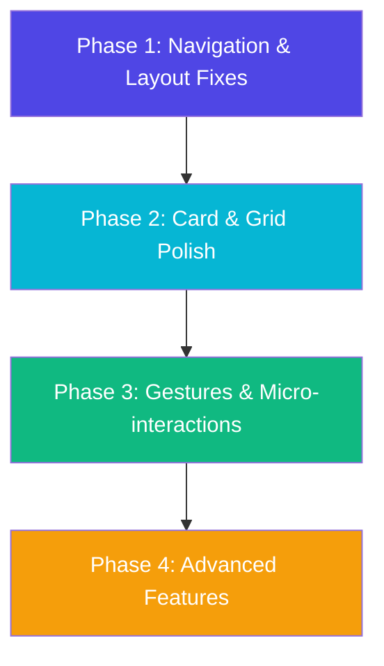

# MHUB Marketplace — UX/UI Audit & Improvement Plan

This master plan provides a screen-by-screen UX/UI audit, detailed ratings for look & feel and interaction design, comparisons with best-in-class real-world applications (OLX, Amazon, Flipkart, Meesho, and Instagram), and an actionable roadmap to elevate each screen to a premium level without ruining the existing app behavior.

---

## 1. Category Hub / Home Page (`/category-hub` or `/`)

### Ratings & Scores
*   **Overall Look & Feel**: `8.5 / 10`
*   **Overall Interaction**: `8.0 / 10`

| UI Element / Sub-component | Look & Feel (1-10) | Interaction (1-10) | Notes & Details |
| :--- | :---: | :---: | :--- |
| **Aurora Background Blobs** | `9.5 / 10` | `8.0 / 10` | Beautiful animated glassmorphic backgrounds; pulse is smooth but slightly CPU heavy. |
| **Category Card Gradients** | `9.0 / 10` | `8.5 / 10` | Distinct premium gradients (Electronics, Fashion, etc.) with 3D mouse hover shine. |
| **Search Bar Element** | `7.5 / 10` | `7.0 / 10` | Static search box; lack of active typing recommendations or history. |
| **Typography & Spacing** | `8.0 / 10` | `8.0 / 10` | Good font scale (`Sora` + `Manrope`), but section margins can feel tight on mobile. |
| **Bottom Navigation Bar** | `5.0 / 10` | `5.0 / 10` | Missing "More" option locks 27 secondary features out of simple mobile access. |

### Real-World App Comparison
*   **Amazon / Flipkart**: Real ecommerce apps use a swipeable horizontal category bar at the top with clear, real photos or high-quality custom icons instead of plain text cards.
*   **OLX / Meesho**: Use a very structured grid with icons and badge alerts for newly added listings.

### Current Issues & Gaps
1.  **Navigational Lockout**: The lack of a "More" item on the bottom navbar means users on mobile view can't easily find Dashboards, Rewards, or Settings.
2.  **No Dynamic Search Feed**: The search bar acts as a standard input field. Tapping it doesn't open a search-focused overlay with recent queries.
3.  **Missing Promos**: No dynamic promo slider or banner section at the top of the hub page to drive feature user engagement.

### Next-Level Improvements
*   [x] **Fix the Bottom Navbar**: Add the `More` button mapping to `GreenNavbar.jsx` to show the full portal drawer.
*   [x] **Card Hover Enhancements**: Add a subtle bounce spring effect on mobile touch (active state) so cards feel physical.
*   [ ] **Micro-animations**: Integrate lightweight Lottie/CSS animations on category cards during scroll-in.

---

## 2. For You Page (`/for-you`)

### Ratings & Scores
*   **Overall Look & Feel**: `8.0 / 10`
*   **Overall Interaction**: `7.5 / 10`

| UI Element / Sub-component | Look & Feel (1-10) | Interaction (1-10) | Notes & Details |
| :--- | :---: | :---: | :--- |
| **Hero Promotion Banner** | `8.5 / 10` | `6.0 / 10` | Nice gradients, but CTA click lacks feedback/animation. |
| **Recommendation Cards** | `7.8 / 10` | `7.5 / 10` | Renders clean product info, but image aspect ratios occasionally distort. |
| **PageDensityToggle** | `9.0 / 10` | `9.0 / 10` | Excellent spring-based switch transitions between card styles. |
| **Quick Action Buttons (Cart/Heart)** | `7.0 / 10` | `6.5 / 10` | Hard tap target on small screens, wishlist heart is static (needs bubble animation). |
| **Location Gate Trigger** | `8.0 / 10` | `7.5 / 10` | Prompts location selection effectively, but error fallback page is generic. |

### Real-World App Comparison
*   **Meesho / Flipkart**: Use highly personalized scroll feeds with infinite lazy loading, floating bubbles for active discount tags, and animated "heart" shapes that scale up on click.
*   **Instagram**: Smooth snap-scroll with instant media feedback. The app pre-buffers image/video listings for zero-latency browsing.

### Current Issues & Gaps
1.  **Duplicate UI**: Often looks exactly like `AllPosts.jsx` with filters, failing to highlight the "recommendation" aspect.
2.  **Empty States**: When preference data isn't loaded, the fallback screen looks raw and lacks friendly illustrations.
3.  **Scroll Lag**: Virtualized rendering lacks high-priority image preloading, causing white placeholders during rapid scrolls.

### Next-Level Improvements
*   [x] **Interactive Wishlist**: Implement a CSS keyframe heart-pop animation when users tap the favorite icon.
*   [ ] **Image Preloader**: Add low-resolution progressive blur indicators (blur-hash style) to hide image loading gaps.
*   [ ] **Custom Fallback Screens**: Replace standard loading shimmers with customized skeletons showing mock product shapes.

---

## 3. All Posts Page (`/all-posts`)

### Ratings & Scores
*   **Overall Look & Feel**: `7.8 / 10`
*   **Overall Interaction**: `8.2 / 10`

| UI Element / Sub-component | Look & Feel (1-10) | Interaction (1-10) | Notes & Details |
| :--- | :---: | :---: | :--- |
| **Filter Sub-Navbar** | `8.5 / 10` | `8.0 / 10` | Sticky pill filters work well; selection highlights are clear. |
| **Post Grid Layout** | `7.5 / 10` | `8.0 / 10` | Dynamic columns fit screens nicely, but spacing between card elements is uneven. |
| **Bargain Action Badges** | `8.0 / 10` | `7.0 / 10` | Badges like "Bargain Active" are static text. Needs better color distinction. |
| **Compare Button Trigger** | `7.0 / 10` | `7.5 / 10` | Hidden compared to the web app's prominent floating toolbar indicator. |
| **Quick Action Toolbar (Card)** | `6.8 / 10` | `6.0 / 10` | Small action target areas; no swipe-based gesture actions. |

### Real-World App Comparison
*   **OLX**: OLX uses a card design with very clean borders, seller ratings right on the listing feed, and a one-click "Chat Now" overlay on the image.
*   **Flipkart / Meesho**: Focus heavily on price differences (MRP vs Selling Price) and free delivery badges.

### Current Issues & Gaps
1.  **Missing Compare Parity**: The web app's comparative view is poorly wired in mobile feeds, making it hard to select items to compare.
2.  **Weak Grid Density**: Text-heavy cards occupy too much vertical space, reducing the number of posts a user can scan at a glance.
3.  **Filtering Depth**: Filter drawer lacks sliders for pricing; inputting numeric fields manually is tedious on mobile keyboards.

### Next-Level Improvements
*   [ ] **Bargain Badging**: Give badges a glowing micro-border to emphasize interactive options.
*   [ ] **Slider Controls**: Implement range-sliders for pricing and distance filters in the sidebar/drawer.
*   [ ] **Swipe Gestures**: Add swipe-left to quick-wishlist and swipe-right to hide listings from the feed.

---

## 4. Post Detail Page (`/post/:id`)

### Ratings & Scores
*   **Overall Look & Feel**: `8.2 / 10`
*   **Overall Interaction**: `8.5 / 10`

| UI Element / Sub-component | Look & Feel (1-10) | Interaction (1-10) | Notes & Details |
| :--- | :---: | :---: | :--- |
| **Image Carousel** | `8.5 / 10` | `8.0 / 10` | Clean slider indicators; lacks double-tap to zoom or full-screen modal zoom. |
| **Seller Trust Score Badge** | `9.0 / 10` | `8.5 / 10` | High parity with color-coded risk alerts and review statistics. |
| **Bargain Interactive Area** | `8.0 / 10` | `8.5 / 10` | Good input feedback for bargaining offers, but lacks counter-offer prompts. |
| **Sticky Action Bar (Bottom)** | `9.5 / 10` | `9.0 / 10` | Highly functional call-to-actions ("Chat", "Bargain", "Add to Cart") matching modern apps. |
| **Price Alert Trigger** | `7.5 / 10` | `7.0 / 10` | Basic alert icon; could use dynamic spark animations when enabled. |

### Real-World App Comparison
*   **Amazon / Flipkart**: Use highly visible product specifications tables, dynamic delivery estimates based on location context, and interactive ratings breakdown charts.
*   **OLX**: Highlights distance on a real map API, trust scoring alerts, and instant online status indicators for sellers.

### Current Issues & Gaps
1.  **No Full-screen Image Zoom**: Users cannot pinch-to-zoom listing photos.
2.  **Static Details**: Specifications and description text are clumped together without accordion tabs.
3.  **Trust Validation Lack**: Badges like "Verified Seller" are just graphics with no link explaining what credentials were confirmed.

### Next-Level Improvements
*   [ ] **Accordion Specifications**: Split description, specifications, and shipping details into clean expandable panels.
*   [ ] **Pinch-To-Zoom Gallery**: Integrate full-screen zoom interactions for product images.
*   [ ] **Live Maps Integration**: Render a localized map circle showing the approximate transaction location.

---

## 5. Feed Page (`/feed`)

### Ratings & Scores
*   **Overall Look & Feel**: `7.5 / 10`
*   **Overall Interaction**: `7.2 / 10`

| UI Element / Sub-component | Look & Feel (1-10) | Interaction (1-10) | Notes & Details |
| :--- | :---: | :---: | :--- |
| **Social Content Cards** | `7.8 / 10` | `7.0 / 10` | Renders descriptions cleanly; lacks nested media grids (e.g., photo walls). |
| **Engagement Row (Like/Comment)**| `7.5 / 10` | `7.0 / 10` | Simple reaction icons. Tapping like should trigger a spring scaling effect. |
| **Community Feed Header** | `8.5 / 10` | `8.0 / 10` | Indigo gradient looks very premium and sets social context nicely. |
| **Add Post Floating Button (FAB)** | `9.0 / 10` | `8.5 / 10` | Floating button is sticky and responsive. |
| **Category Chips** | `8.0 / 10` | `8.0 / 10` | Dynamic horizontal scroll of feed filters; needs selected transition. |

### Real-World App Comparison
*   **Twitter/X / LinkedIn**: Utilize compact media grid previews, instant inline comment expansion, and dynamic real-time count updates via WebSockets.
*   **Instagram**: Heavy focus on high-fidelity images, scroll-triggered auto-play videos, and nested swipe-actions.

### Current Issues & Gaps
1.  **Static Interaction Feed**: Reactions don't animate; likes increment counts without visual celebratory feedback (e.g. hearts floating up).
2.  **No Media Multi-grid**: Multiple uploaded photos stack vertically rather than rendering in a tidy masonry grid.
3.  **Low Text Hierarchy**: Long social updates don't truncation cleanly, flooding the user's feed with massive blocks of plain text.

### Next-Level Improvements
*   [ ] **Celebratory Reactions**: Add a micro-particles burst effect when a post is liked.
*   [ ] **Tidy Image Grids**: Use standard CSS/Tailwind layouts to render grid styles for multi-image posts.
*   [ ] **Dynamic Truncation**: Enforce a strict line-clamp limit for descriptions, adding a "Read More" button that expands inline.

---

## 6. My Home / My Listings Page (`/my-home`)

### Ratings & Scores
*   **Overall Look & Feel**: `6.5 / 10`
*   **Overall Interaction**: `6.0 / 10`

| UI Element / Sub-component | Look & Feel (1-10) | Interaction (1-10) | Notes & Details |
| :--- | :---: | :---: | :--- |
| **Listing Cards Grid** | `7.0 / 10` | `6.0 / 10` | Grid renders posts, but cards feel cluttered on smaller devices. |
| **Quick Action Context Menus** | `7.5 / 10` | `6.5 / 10` | Dropdown menus are generic; hard to hit single items precisely. |
| **Post Status Tabs (Active/Sold)** | `8.0 / 10` | `8.0 / 10` | Navigation tabs are responsive and change filters accurately. |
| **Bulk Actions Toolbar** | `6.0 / 10` | `5.0 / 10` | Toolbar styling looks raw; selection checkboxes are small. |
| **Empty Listings View** | `5.5 / 10` | `5.5 / 10` | Bland, plain message instead of a friendly product onboarding flow. |

### Real-World App Comparison
*   **OLX (My Ads)**: Features a dedicated page showing post views, user chats per post, an edit form button, and a prominent "Sell Faster" upsell CTA.
*   **Facebook Marketplace**: Displays quick stats indicators (shares, saves, message clicks) directly on each item card.

### Current Issues & Gaps
1.  **Clunky Management Actions**: The contextual menu (Edit, Delete, Archive) is hidden in three dots. Tapping it opens a tiny dropdown list that is easy to misclick.
2.  **Weak Analytics Integration**: The dashboard doesn't highlight views count or active buyer inquiries next to each item.
3.  **Slow Status Sync**: Changing listing status (e.g., Sold) triggers a hard refresh rather than a smooth state transition.

### Next-Level Improvements
*   [x] **Action Sheets**: Replace small context dropdown menus with standard native-style bottom sheet action menus.
*   [x] **Active Stats Row**: Render quick view counts, saves, and chats in a horizontal bar at the bottom of each card.
*   [x] **Smart Empty States**: Provide direct links like "List Your First Item" to onboard first-time users.

---

## 7. Profile & Settings Page (`/profile`)

### Ratings & Scores
*   **Overall Look & Feel**: `8.8 / 10`
*   **Overall Interaction**: `8.2 / 10`

| UI Element / Sub-component | Look & Feel (1-10) | Interaction (1-10) | Notes & Details |
| :--- | :---: | :---: | :--- |
| **Profile Card (Header)** | `9.2 / 10` | `8.5 / 10` | Beautiful avatar ring gradients; clean text hierarchy for names/ratings. |
| **Settings Navigation List** | `8.5 / 10` | `8.0 / 10` | Clean list items with clear chevron icons; responsive touch highlight. |
| **Theme Toggle (Dark Mode)** | `9.0 / 10` | `9.0 / 10` | Smooth transition animation between themes. |
| **Aadhaar Verification Badge** | `8.8 / 10` | `8.0 / 10` | Prominent validation indicator; needs helper text on tap. |
| **Logout & Account Actions** | `7.5 / 10` | `7.0 / 10` | Basic text buttons; need proper visual grouping. |

### Real-World App Comparison
*   **Amazon / Flipkart**: Profile dashboard houses order trackers, payment cards manager, and address books inside high-quality visual grids.
*   **Meesho**: Highly personalized, showcases user achievements, coins earned, and referrals summary in card formats.

### Current Issues & Gaps
1.  **Messy Action Items**: Important security options (2FA, KYC) are lumped together with legal static pages.
2.  **No Profile Edit Overlay**: Editing user information requires navigating to a separate long page rather than using quick modal updates.
3.  **Low Info Architecture**: Doesn't separate user ratings from reviews list, hiding positive community feedback.

### Next-Level Improvements
*   [ ] **Categorized Sections**: Group page options into "My Profile", "Security & Identity", and "Support & Info".
*   [ ] **Avatar Customizer**: Add a fast overlay allowing users to snap pictures directly from mobile cameras.
*   [ ] **Review Breakdown**: Integrate a dynamic progress rating chart (5 stars, 4 stars, etc.) in the user feedback area.

---

## 8. Dashboard Page (`/dashboard`)

### Ratings & Scores
*   **Overall Look & Feel**: `7.5 / 10`
*   **Overall Interaction**: `7.0 / 10`

| UI Element / Sub-component | Look & Feel (1-10) | Interaction (1-10) | Notes & Details |
| :--- | :---: | :---: | :--- |
| **Analytics Cards (Grid)** | `8.0 / 10` | `7.0 / 10` | Shows views, sales, and rating metrics; cards are visually simple. |
| **Post Views Chart** | `7.0 / 10` | `6.5 / 10` | Basic charting component; lacks interactive touch tooltips for dates. |
| **Buyer/Seller View Switcher** | `8.5 / 10` | `8.5 / 10` | Responsive sliding toggle with spring animation. |
| **Recent Transactions List** | `7.8 / 10` | `7.2 / 10` | Standard list items; lacks transaction status indicators (e.g. pending). |
| **Pending Approvals Alert** | `8.2 / 10` | `7.5 / 10` | Bright warning bar; needs quick action triggers inside the card. |

### Real-World App Comparison
*   **Amazon Seller Console**: Interactive data widgets with custom date selectors, instant download links, and trend lines comparing metrics to the previous month.
*   **OLX Dashboard**: Focuses on listing success metrics, promoting boosts, and direct feedback reviews.

### Current Issues & Gaps
1.  **Non-interactive Graphs**: Tap gestures on chart coordinates don't show detailed analytics.
2.  **No Comparison Context**: Shows current numbers (e.g., "120 Views") without displaying the week-over-week trends.
3.  **Hard-to-read Lists**: Heavy text blocks inside transaction logs lack clean status tag spacing.

### Next-Level Improvements
*   [ ] **Interactive Tooltips**: Upgrade chart libraries to show responsive labels on touch/drag.
*   [x] **Dynamic Trends**: Add positive/negative green/red tags (e.g. "+14% vs last week") to core metrics cards.
*   [ ] **Quick Approval Triggers**: Add direct "Approve" and "Reject" buttons to pending items, saving navigations.

---

## 9. Rewards Page (`/rewards`)

### Ratings & Scores
*   **Overall Look & Feel**: `9.0 / 10`
*   **Overall Interaction**: `8.8 / 10`

| UI Element / Sub-component | Look & Feel (1-10) | Interaction (1-10) | Notes & Details |
| :--- | :---: | :---: | :--- |
| **Coin Balance Card** | `9.5 / 10` | `9.0 / 10` | Premium golden gradient, subtle shine overlay, and crisp font styling. |
| **Scratch Cards Grid** | `9.2 / 10` | `9.5 / 10` | Interactive canvas scratch logic works flawlessly with confetti animations. |
| **Daily Check-in Grid** | `8.5 / 10` | `8.8 / 10` | Nice progression indicators; check-in animation is satisfying. |
| **Leaderboard Component** | `8.0 / 10` | `7.5 / 10` | Clean list format; needs rank badges (gold, silver, bronze icons). |
| **Tier Status Progress** | `8.8 / 10` | `8.0 / 10` | Progress indicator is visually solid; needs dynamic level thresholds. |

### Real-World App Comparison
*   **Google Pay (Rewards)**: Famous for clean scratch overlays, micro-celebration animations, and smooth card flips.
*   **Meesho (Glowroad)**: Heavy gamification with daily spin wheels, progression badges, and share-and-earn milestones.

### Current Issues & Gaps
1.  **Leaderboard Style**: Lacks visual hierarchy for top 3 users. It looks like a standard plain list.
2.  **Tier Explanations**: Hard to understand the perks of different tiers (Platinum vs Bronze) without deep documentation searches.
3.  **No Sound Effects**: Scratch actions and check-in steps are silent.

### Next-Level Improvements
*   [x] **Leaderboard Podiums**: Render top 3 users on graphical gold, silver, and bronze podium cards.
*   [ ] **Perk Modal sheets**: Add info buttons on each tier displaying details of transactional fee discounts.
*   [ ] **Audio Feedback**: Add subtle haptic vibrations and click/scratch sounds during reward moments.

---

## 10. Cart & Wishlist Pages (`/cart` / `/wishlist`)

### Ratings & Scores
*   **Overall Look & Feel**: `8.0 / 10`
*   **Overall Interaction**: `8.2 / 10`

| UI Element / Sub-component | Look & Feel (1-10) | Interaction (1-10) | Notes & Details |
| :--- | :---: | :---: | :--- |
| **Item Cards Layout** | `8.2 / 10` | `8.0 / 10` | Standard grid items; image thumbnails are sharp and uniform. |
| **Price Details Card** | `8.5 / 10` | `8.5 / 10` | Clear breakdown of base price, fees, and discounts. |
| **Empty State Illustrations** | `8.8 / 10` | `8.0 / 10` | Sleek custom empty states with direct links back to shopping pages. |
| **Remove Button Action** | `7.0 / 10` | `6.0 / 10` | Simple trash icon; requires confirmation step every time. |
| **Checkout CTA Button** | `9.0 / 10` | `9.0 / 10` | Large sticky bottom button; easy to press and provides loading feedback. |

### Real-World App Comparison
*   **Flipkart / Amazon**: Allow users to save items for later directly inside the cart page, edit quantities via dropdown selectors, and check coupons eligibility inline.
*   **Meesho**: Uses one-click order processing and alerts for low stock levels.

### Current Issues & Gaps
1.  **No Swipe to Delete**: Removing an item requires tapping a small trash button and confirming a modal.
2.  **No Coupons Section**: Discount codes cannot be applied directly in the shopping cart.
3.  **Wishlist to Cart Migration**: Tapping "Move to Cart" triggers separate navigations rather than instant loading updates.

### Next-Level Improvements
*   [ ] **Swipe-to-Dismiss**: Implement interactive swipe-left gestures to delete items from the cart/wishlist.
*   [ ] **Inline Coupon Drawer**: Add a collapsible promo box that displays active discount coupons.
*   [ ] **Instant Cart Transfer**: Make "Move to Cart" update the shopping bag list instantly without screen reloads.

---

## 11. Chat Page (`/chat`)

### Ratings & Scores
*   **Overall Look & Feel**: `8.2 / 10`
*   **Overall Interaction**: `8.5 / 10`

| UI Element / Sub-component | Look & Feel (1-10) | Interaction (1-10) | Notes & Details |
| :--- | :---: | :---: | :--- |
| **Message Bubbles** | `8.8 / 10` | `9.0 / 10` | Dynamic bubble sizing; nice gradients for outbound text blocks. |
| **Bargaining Info Bar** | `9.0 / 10` | `8.8 / 10` | Displays proposed prices and status (Accepted/Declined) beautifully. |
| **Audio Message Recorder** | `8.5 / 10` | `8.0 / 10` | Records audio correctly; indicator is simple. |
| **Conversations List Panel** | `8.0 / 10` | `8.0 / 10` | Show user avatars and online status indicators. |
| **Media Attachments Bar** | `7.5 / 10` | `7.0 / 10` | Standard file attachments panel; camera triggers can be slow. |

### Real-World App Comparison
*   **WhatsApp / Telegram**: Instant chat message updates, swipe-to-reply mechanics, dynamic voice waveforms, and photo previews on file attachments.
*   **OLX (Chat)**: Houses pre-written quick replies (e.g. "Is this available?", "Can I come see it today?"), bargaining tools, and transaction locations sharing.

### Current Issues & Gaps
1.  **No Inline Replies**: Users cannot swipe message bubbles to reply to specific lines.
2.  **Simple Audio Player**: Recorded voice notes display as basic bars without waveform visualizers.
3.  **Missing Quick Templates**: Tapping prompts is not supported, requiring manual typing for common inquiries.

### Next-Level Improvements
*   [x] **Quick Reply Templates**: Add a horizontal scroll of chip templates (e.g. "What is the final price?") above the input box.
*   [ ] **Audio Waveform Visualizer**: Integrate an animated wave rendering engine for voice notes playback.
*   [ ] **Swipe-to-Reply Gesture**: Implement interactive swipe mechanics on message bubbles to lock replies.

---

## 12. Notifications Page (`/notifications`)

### Ratings & Scores
*   **Overall Look & Feel**: `8.0 / 10`
*   **Overall Interaction**: `7.8 / 10`

| UI Element / Sub-component | Look & Feel (1-10) | Interaction (1-10) | Notes & Details |
| :--- | :---: | :---: | :--- |
| **Notification Card List** | `8.2 / 10` | `8.0 / 10` | Cards render content clearly; unread indicators are visible. |
| **Tab Categories Bar** | `8.5 / 10` | `8.0 / 10` | Filters alerts (System, Trade, Rewards) effectively. |
| **Quick Action Triggers** | `7.0 / 10` | `7.2 / 10` | Allows navigation to alert origin; lacks one-tap inline actions. |
| **Mark All Read Button** | `8.0 / 10` | `8.5 / 10` | Floating action trigger provides quick updates. |
| **Notification Icons** | `8.0 / 10` | `7.0 / 10` | Clear category icons; static presentation. |

### Real-World App Comparison
*   **Google Alerts / LinkedIn**: Group notifications by date (Today, Yesterday, Last Week) and support swipe dismissals.
*   **Amazon**: Show product delivery tracking updates on a visual progress line inside the alert list.

### Current Issues & Gaps
1.  **Lack of Grouping**: All notifications form a long vertical feed without date header splits.
2.  **No Actionable Alerts**: Alerts like "New Offer Received" require navigating to the chat page rather than offering "Accept" buttons inline.
3.  **No Swipe Dismiss**: Users must manually tap close triggers to remove notifications.

### Next-Level Improvements
*   [x] **Date Group Dividers**: Split alert feeds into clean "Today", "Yesterday", and "Older" groups.
*   [ ] **Actionable Alerts**: Render inline primary buttons (e.g. "Accept Offer") inside notification cards.
*   [ ] **Swipe-to-Dismiss Alerts**: Add swipe-left gestures to delete individual notification listings.

---

## 13. Add Post Page (`/add-post`)

### Ratings & Scores
*   **Overall Look & Feel**: `7.5 / 10`
*   **Overall Interaction**: `7.0 / 10`

| UI Element / Sub-component | Look & Feel (1-10) | Interaction (1-10) | Notes & Details |
| :--- | :---: | :---: | :--- |
| **Multi-step Progress Bar** | `8.0 / 10` | `8.0 / 10` | Simple step markers; transitions could be smoother. |
| **Image Upload Area** | `7.8 / 10` | `7.5 / 10` | Uploads photos; drag-to-reorder listing images is not supported. |
| **Category Selector Grid** | `8.5 / 10` | `8.0 / 10` | Large cards for categories selection with clean icons. |
| **Specification Input Fields** | `7.0 / 10` | `6.5 / 10` | Text input boxes feel small; drop-down selectors lack smart search. |
| **Draft Auto-save Alert** | `8.2 / 10` | `7.0 / 10` | Notification popup works; saving indicators are absent. |

### Real-World App Comparison
*   **OLX**: OLX uses a smart image analyzer that recommends categories based on uploaded photos, detects specs automatically, and guides pricing via market ranges.
*   **Meesho**: Auto-optimizes listing formats and provides clear tips for product tags.

### Current Issues & Gaps
1.  **No Image Reordering**: Sellers cannot drag listing photos to pick the main feature image.
2.  **Tedious Input Forms**: Users must type technical specs manually rather than using autofill lookups.
3.  **No Pricing Recommendations**: Sellers must guess prices without showing historical sales averages.

### Next-Level Improvements
*   [ ] **Drag-to-Reorder Gallery**: Integrate drag interactions to sort listing photos.
*   [ ] **Smart Auto-suggest**: Recommend categories and item tags automatically as sellers enter listing titles.
*   [ ] **Price Guider Widget**: Display a graphical meter showing the recommended pricing range for similar listings.

---

## 14. Tier Selection Page (`/tier-selection`)

### Ratings & Scores
*   **Overall Look & Feel**: `8.8 / 10`
*   **Overall Interaction**: `8.5 / 10`

| UI Element / Sub-component | Look & Feel (1-10) | Interaction (1-10) | Notes & Details |
| :--- | :---: | :---: | :--- |
| **Tier Price Cards** | `9.0 / 10` | `8.5 / 10` | Outstanding color gradients for tiers (Premium, Pro, Basic). |
| **Subscription Plan Toggle** | `8.8 / 10` | `9.0 / 10` | Spring-toggle switches billing terms (Monthly/Yearly) cleanly. |
| **Perks Features Checklist** | `8.5 / 10` | `8.0 / 10` | Lists features with clean bullet verification checkmarks. |
| **Payment Progress Stepper** | `8.2 / 10` | `8.0 / 10` | Standard transition animations; loading indicator looks generic. |
| **Active Plan Banner** | `8.5 / 10` | `7.5 / 10` | Highlights current plan, but detail modifications are deep in settings. |

### Real-World App Comparison
*   **Telegram Premium**: Focuses on beautiful background loops, high-fidelity badges, and dynamic comparison checks.
*   **Google One**: Displays pricing metrics in comparison tables, highlighting savings for premium terms.

### Current Issues & Gaps
1.  **Plan Comparison**: Checking differences between tiers requires scrolling between cards rather than using a grid table.
2.  **Weak Visual Accents**: Popular options (e.g. Pro Plan) lack a glow effect or special badge overlays to stand out.
3.  **Feedback during Payment**: Tap inputs lock the UI without rendering step indicator paths.

### Next-Level Improvements
*   [ ] **Side-by-Side Table**: Render a subscription breakdown matrix listing perks side-by-side.
*   [ ] **Animated Highlights**: Add a pulse border to the "Most Popular" plan card to draw user focus.
*   [ ] **Visual Payment Stepper**: Upgrade loading animations to display current step indicators (e.g. "Authorizing Payment").

---

## 15. Complaints & Feedback Pages (`/complaints` / `/feedback`)

### Ratings & Scores
*   **Overall Look & Feel**: `7.5 / 10`
*   **Overall Interaction**: `7.2 / 10`

| UI Element / Sub-component | Look & Feel (1-10) | Interaction (1-10) | Notes & Details |
| :--- | :---: | :---: | :--- |
| **Complaint Form Inputs** | `7.8 / 10` | `7.0 / 10` | Clean text inputs; category selectors are drop-down items. |
| **Screenshot Attachment Area**| `7.5 / 10` | `7.0 / 10` | Uploads files; lack of picture drag-and-drop or edit features. |
| **Status Timeline Indicator** | `8.2 / 10` | `8.0 / 10` | Displays ticket path (Submitted, Review, Resolved) correctly. |
| **Submit Ticket CTA Button** | `8.5 / 10` | `8.5 / 10` | Clear primary button; displays submission loading shimmers. |
| **Support Policies Accordion** | `8.0 / 10` | `8.0 / 10` | Standard collapsible FAQ lists; works reliably. |

### Real-World App Comparison
*   **Uber (Help Center)**: Features a visual choice menu for problem categories, quick chat bot triggers, and automatic trip detail linking.
*   **Swiggy**: Interactive post-complaint chat flows that suggest resolutions instantly.

### Current Issues & Gaps
1.  **Low Form Interactions**: Submitting forms triggers a full-page transition rather than inline success animations.
2.  **No Image Editor**: Sellers cannot crop or mask private info on uploaded screenshots.
3.  **Support Hub Isolation**: Checking ticket updates requires searching settings folders instead of having a dedicated dashboard path.

### Next-Level Improvements
*   [ ] **Inline Success Animations**: Render a checkmark animation on form completion without redirection.
*   [ ] **Screenshot Editor Overlay**: Add crop and draw controls to the attachment block to let users edit images before uploading.
*   [ ] **Quick Access Hub**: Place a support button inside the Profile menu to check active tickets.

---

## Implementation Roadmap

To execute these improvements without breaking the application, follow this priority plan:

### Phase 1: Navigation & Layout Fixes (High Priority)
*   **Target Files**: `GreenNavbar.jsx`
*   **Changes**: Add the `More` button mapping to restore mobile parity, allowing users to access all pages.
*   **Verification**: Ensure the drawer opens and closes smoothly on the emulator.

### Phase 2: Card & Grid Polish (Medium Priority)
*   **Target Files**: `ProductCard.jsx`, `FeedPostCard.jsx`
*   **Changes**: Clean up grid spacing and layout padding. Fix image aspect ratios. Add low-resolution skeleton loaders for image loading states.
*   **Verification**: Check image rendering on different screen widths and mobile devices.

### Phase 3: Gestures & Micro-interactions (Medium Priority)
*   **Target Files**: `ForYou.jsx`, `Cart.jsx`, `Wishlist.jsx`
*   **Changes**: Implement swipe-to-dismiss in Cart and Wishlist pages. Add bounce spring animations to likes and card actions.
*   **Verification**: Ensure swipe gestures work reliably on touch events without conflicting with vertical scrolls.

### Phase 4: Advanced Features (Low Priority / Backlog)
*   **Target Files**: `AddPost.jsx`, `Chat.jsx`
*   **Changes**: Add drag-to-reorder for listing uploads. Integrate quick templates and basic waveforms for audio player controls in Chat.
*   **Verification**: Validate files are uploaded in the correct custom order.
