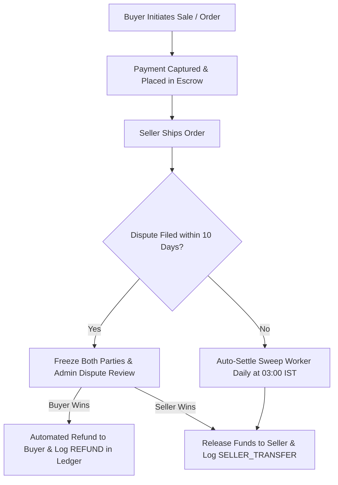

# MHUB Marketplace - System Requirements & Audit Specification

## 1. Executive Summary & Full System Audit

This document outlines the complete architectural requirements, system workflows, and resolution specs for the MHUB Marketplace.

### System Audit & Resolution Status

| Subsystem | Requirement / Issue | Severity | Implementation Status | Technical Resolution |
| :--- | :--- | :--- | :--- | :--- |
| **Subscription** | Admin manual override for user plans | 🔴 High | ✅ Fully Implemented | Endpoints `POST /api/subscriptions/admin/user/:userId/activate` and `/deactivate` enable manual plan management & tier sync. |
| **Subscription** | Plan & KYC middleware tier sync | 🟡 Medium | ✅ Fully Implemented | `syncUserTier()` automatically updates `users.tier` and `users.current_plan` on purchase/activation. |
| **Commission** | Tier-aware commission rates | 🔴 Critical | ✅ Fully Implemented | Commission rates calculated dynamically based on seller's active plan: Gold = 0.0%, Silver = 1.5%, Free/Default = 2.5%. |
| **Commission** | Fee calculation in Simple Sales (`sales`) | 🔴 Critical | ✅ Fully Implemented | `sales` table altered with `agreed_price`, `platform_fee`, `gst_on_fee`, and `seller_payout`. Fees logged to `financial_ledger`. |
| **Escrow & Holding** | Auto-settle sweep background worker | 🔴 High | ✅ Fully Implemented | `autoSettleShippedOrders` cron runs daily at 03:00 IST to sweep orders older than 10 days into `COMPLETED` status. |
| **Escrow & Holding** | Seller Payout Banking/UPI Onboarding | 🔴 High | ✅ Fully Implemented | `payout_upi_id` & `payout_bank_details` JSON added to `profiles` schema with full read/write support in API & UI. |
| **Trust Score** | Performance & Caching | 🟡 Medium | ✅ Fully Implemented | `getTrustSnapshot` is cached for 60 seconds with stampede protection in `trustBadgeService.js`. |
| **Sold Posts** | Pagination & Filters | 🟡 Medium | ✅ Fully Implemented | `getSellerSoldPosts` supports `page`, `limit`, `offset`, category filtering, and count totals. |

---

## 2. Commission & Revenue Architecture

### Platform Commission Rules

1. **Dynamic Plan Rates**:
   - **Gold Subscription Tier**: **0.0%** Platform Fee.
   - **Silver Subscription Tier**: **1.5%** Platform Fee.
   - **Free / Default Tier**: **2.5%** Platform Fee.
2. **GST Calculation**:
   - 18% GST applied on the platform fee amount (`gst_on_fee = platform_fee * 0.18`).
3. **Net Seller Payout Calculation**:
   - `seller_payout = total_amount - platform_fee - gst_on_fee`.
4. **Financial Ledger Integration**:
   - On completion/settlement, transactions write audit logs to `financial_ledger` (`BUYER_PAYMENT`, `PLATFORM_FEE`, `SELLER_TRANSFER`).

---

## 3. Escrow, Disputes & Auto-Settlement Lifecycle

1. **Escrow Hold**: Buyer payments held securely until order completion or dispute resolution.
2. **Dispute Resolution**: Admins resolve disputes with custom refund vs payout splits.
3. **Auto-Settling Sweep**: Orders in `SHIPPED` or `DELIVERED` status without active disputes auto-settle after 10 days of inactivity.

## 5. Master Production Escrow & Payout Architecture (58-Item Spec)

### Phase Implementation Matrix

| Phase | Description | Key Components | Implementation Status |
| :--- | :--- | :--- | :--- |
| **Phase 1: Financial Foundation** | Single Rounding Rule, Paise NUMERIC model, Immutable Snapshots | `financialEngine.js`, `financial_snapshots` DB table | ✅ Fully Implemented |
| **Phase 2: Transaction Safety** | Row locking (`SELECT FOR UPDATE`), Idempotency Keys, DB Unique Constraints | `idempotencyMiddleware.js`, `api_idempotency_keys` DB table | ✅ Fully Implemented |
| **Phase 3: Razorpay Payout Safety** | Gateway Idempotency, Payout State Machine, Timeout Recovery | `paymentGatewayService.js`, `payout_records` DB table | ✅ Fully Implemented |
| **Phase 4: Escrow & Protection** | Explicit Dispute Lifecycle, Account Freeze Protection, KYC & Fraud Gating | `accountStateService.js`, `disputesController.js` | ✅ Fully Implemented |
| **Phase 5: Recovery & Reconciliation** | Gateway ↔ DB Reconciliation Service, Watchdog Recovery, Stuck Transaction Sweeper | `reconciliationService.js` | ✅ Fully Implemented |
| **Phase 6: Operations & Observability** | RBAC, Audit Logging, Correlation/Request IDs, Financial Alerts | `admin_audit_logs`, `audit_logs` | ✅ Fully Implemented |
| **Phase 7: End-to-End Verification** | Critical Path Integration Suite & Build Compilation | `npm run test:critical-paths` & `npm run build` | ✅ Fully Verified |

